Breeding Investigation
================
Callan Hoskins
2020-03-06

  - [Families within Captive Cetacean
    Populations](#families-within-captive-cetacean-populations)
      - [Data cleaning](#data-cleaning)
      - [Finding each animal’s number of
        progeny](#finding-each-animals-number-of-progeny)
      - [Plotting family trees](#plotting-family-trees)
          - [Orcas](#orcas)
          - [Dolphins](#dolphins)

# Families within Captive Cetacean Populations

``` r
# Read in data on individual cetaceans
all_cetacean_data <- 
  read_rds(all_cetacean_data_file_path)
```

We now want to inspect some of the family ties between cetaceans in
captivity. But first, we have to make sure that our data is clean.

## Data cleaning

These animals are connected not by unique identifiers but by their
names, some of which may be spelled incorrectly. We have to make sure
that each `name` is unique to one animal.

``` r
all_cetacean_data <-
  all_cetacean_data %>% 
  rename(
    "id" = X1
  ) %>% 
  mutate(
    name = str_to_lower(name), 
    mother = str_to_lower(mother), 
    father = str_to_lower(father)
  ) %>% 
  filter(!name %in% na_names)
```

``` r
duplicate_entries <-
  all_cetacean_data %>% 
  filter(!str_detect(name, "no |fetus|none|unk")) %>% 
  mutate(
    name = case_when(
      name == "(joe)" ~ "joe", 
      name == "(rosalie)" ~ "rosalie", 
      TRUE ~ name
    )
  ) %>% 
  count(name, species, entry_date, status_date) %>% 
  filter(n >= 2) %>% 
  pull(name)

duplicate_entries
```

    ##  [1] "alia"      "bodie"     "kai'nalu"  "khloe"     "lazarus"   "liko"     
    ##  [7] "mirabella" "misty"     "noelani"   "orion"     "ping"      "sonny"    
    ## [13] "spanky"    "splash"    "spray"

There are almost 20 animals that have more than one entry for their
`name` / `entry_date` combination. I will visually inspect these
duplicates and select the entry for each that seems most accurate.

``` r
all_cetacean_data %>% 
  filter(name %in% duplicate_entries) %>% 
  select(name, id, entry_date, official_id, everything()) %>% 
  arrange(name, entry_date)
```

    ## # A tibble: 52 x 22
    ##    name     id entry_date official_id species sex   accuracy birth_year
    ##    <chr> <dbl> <date>     <chr>       <chr>   <chr> <chr>    <date>    
    ##  1 alia    199 2007-12-04 NOA0006436… Bottle… F     a        2007-01-01
    ##  2 alia    607 2007-12-04 NOA0006436… Bottle… F     a        2007-01-01
    ##  3 bodie   236 2010-06-07 NOA0006642… Bottle… M     a        2010-01-01
    ##  4 bodie   609 2010-06-07 NOA0006642… Bottle… M     a        2010-01-01
    ##  5 bodie   304 2014-10-17 NOA0010183… Bottle… M     a        2014-01-01
    ##  6 kai'…    66 1996-10-03 NOA0003746… Bottle… M     a        1996-01-01
    ##  7 kai'…   603 1996-10-03 NOA0003746… Bottle… M     a        1996-01-01
    ##  8 khloe   201 2008-04-18 NOA0006454… Bottle… F     a        2008-01-01
    ##  9 khloe   608 2008-04-18 NOA0006454… Bottle… F     a        2008-01-01
    ## 10 laza…   511 2002-07-19 NOA006134,… Bottle… M     e        NA        
    ## # … with 42 more rows, and 14 more variables: acquisition <chr>,
    ## #   origin_date <date>, origin_loc <chr>, mother <chr>, father <chr>,
    ## #   transfers <chr>, currently <chr>, region <chr>, status <chr>,
    ## #   status_date <date>, cod <chr>, notes <chr>, transfer_date <date>,
    ## #   transfer <chr>

I will have to fix some of this data manually. I had to find some
updates online. Here is a summary of my changes:

  - “Alia” the bottlenose dolphin passed away at Dolphinaris Arizona on
    May 22, 2018. I am combining her information into one updated entry.
  - “Bodie” the bottlenose dolphin passed away at Dolphinaris Arizona on
    September 23, 2017. I am combining his information into one updated
    entry.
  - There is a second bottlenose dolphin named “Bodie” who was born in
    2014 and is currently at Seaworld San Diego who should still be
    included in the data.
  - “Kai’nalu” the bottlenose dolphin passed away at Dolphinaris Arizona
    on January 31, 2019. I am combining his information into one updated
    entry.
  - “Khloe” the bottlenose dolphin passed away at Dolphinaris Arizona on
    December 31, 2019. I am combining her information into one updated
    entry.
  - Neither of the two entries for “Lazarus” seems to give more
    information. I am arbitrarily dropping the entry with `id = 1810`.
  - “Liko” the bottlenose dolphin at Dolphinaris Arizona is currently
    still alive and at Dolphinaris Arizona. I will update this
    information, collected 2/2/2019. I will drop Liko’s unknown `status`
    entry.
  - There is a second bottlenose dolphin named “Liko” unrelated to the
    one at Dolphinaris Arizona. I will keep his entry as-is.
  - The entry for “Mirabella” with `id = 1691` has information about
    Mirabella’s mother and father, so I will drop the other one (`id
    = 1069`).
  - There are two nearly-identical entries for a dolphin named “Misty”
    who was born 1980-07-27 and died 2005-01-18. One of the entries says
    that his father was “Spray” and the other one has `NA` for that
    entry, so we will choose the more complete entry (remove `id
    = 2011`).
  - “Noelani” the dolphin at Dolphinaris Arizona was reportedly alive
    2/2/2019. I will combine her repetitive entries into one updated
    one.
  - There is a second, unrelated “Noelani” who I will not edit.
  - “Orion” the bottlenose dolphin born in 1982 seems to have more
    information in the entry with `id = 780`. I will drop his entry with
    `id = 1656`.
  - There is a second, seemingly unrelated bottlenose dolphin named
    “Orion” whose information I will not edit.
  - “Ping” of Dolphinaris Arizona was reportedly alive 2/2/2019. I will
    combine her repetitive entries into one.
  - “Sonny” the bottlenose dolphin of Dolphinaris Arizona was reportedly
    alive 2/2/2019. I will combine his repetitive entries into one
    updated entry and leave the rest of the separate “Sonny” entries
    alone.
  - There are three repetitive entries for the bottlenose dolphin named
    “Spanky,” and one is far more informative than the others. I will
    remove the two that are uninformative.
  - There are two repetitive entries for the bottlenose dolphin named
    “Splash,” and one is more informative than the other. I will
    remove the one that is uninformative. The remaining dolphins named
    “Splash” are unique.
  - There are two repetitive entries for the bottlenose dolphin named
    “Spray,” and one is more informative than the other. I will remove
    the one that is uninformative. The remaining dolphins named “Spray”
    are unique.

<!-- end list -->

``` r
all_cetacean_data <-
  all_cetacean_data %>% 
  filter(
    !(name == "alia" & status == "Unknown"), # drop one of alia's entries
    !(name == "bodie" & id != 304 & status == "Unknown"), # drop one of bodie1's entries
    !(name == "kai'nalu" & id != 603), # drop one of kai'nalu's entries
    !(name == "khloe" & id != 608), # drop one of khloe's entries, 
    !id == 1810, # drop one of Lazarus's entries, 
    !(name == "liko" & status == "Unknown"), # drop one of liko's entries
    !(name == "mirabella" & id == 1069), # drop one of Mirabella's entries
    !(name == "misty" & id == 2011), # drop one of misty's entries
    !(name == "noelani" & status == "Unknown"), # drop one of noelani's entries
    !(name == "orion" & id == 1656), # drop one of orion's entries
    !(name == "ping" & status == "Unknown"), # drop one of ping's entries
    !(name == "sonny" & status == "Unkown" & id == 605), # drop one of sonny's entries
    !(name == "spanky" & id != 751), # remove two repetitive entries for spanky
    !(name == "splash" & id == 1807), # remove a repetitive entry for splash
    !(name == "spray" & id == 2176)
  ) %>% 
  mutate(
    status = if_else(name == "alia", "Died", status), # update alia's info
    status_date = 
      if_else(name == "alia", make_date(2018L, 5L, 22L), status_date), # update alia's info
    status = if_else(name == "bodie", "Died", status), # update bodie's info
    status_date = 
      if_else(name == "bodie", make_date(2017L, 9L, 23L), status_date), # update bodie's info
    status = if_else(name == "kai'nalu", "Died", status), # update kai'nalu's info
    status_date = 
      if_else(name == "kai'nalu", make_date(2019L, 1L, 31L), status_date), #update kai'nalu's info
    status = if_else(name == "khloe", "Died", status), # update khloe's info
    status_date = 
      if_else(name == "khloe", make_date(2018L, 12L, 1L), status_date), #update khloe's info
    status = if_else(name == "liko", "Alive", status), # update liko's status
    status_date = 
      if_else(name == "liko", make_date(2019L, 2L, 2L), status_date), # update liko's status
    status_date = 
      if_else(
        name == "noelani" & id == 241, 
        make_date(2019L, 2L, 2L), 
        status_date
      ), # update noelani's info
    status = if_else(name == "ping", "Alive", status), # update ping's info
    status_date = 
      if_else(name == "ping", make_date(2019L, 2L, 2L), status_date), # update ping's info
    status_date = 
      if_else(
        name == "sonny" & id == 213, 
        make_date(2019L, 2L, 2L), 
        status_date
      ), # update sonny's info
  )
```

In case you were wondering about the number of deaths/unknown
information at Dolphinaris Arizona, the facility closed in 2019 due to
the fact that four of their eight dolphins died within the first two
years of their opening. You can read about it
[here](!https://www.abc15.com/news/region-northeast-valley/scottsdale/dolphinaris-arizona-temporarily-closing-after-death-of-facilitys-fourth-dolphin).

## Finding each animal’s number of progeny

As an exploratory analysis, we want to see if we can find the number of
progeny born from each animal in the dataset. Let’s write a function we
can map to each cetacean that will give us the number of progeny that
animal produced.

``` r
calc_num_progeny <- function(name_param, sex_param) {
  if (sex_param == "F") {
    all_cetacean_data %>% 
      filter(mother == name_param) %>% 
      nrow()
  } else {
    all_cetacean_data %>% 
      filter(father == name_param) %>% 
      nrow()
  }
}

fertile_cetaceans <-
  all_cetacean_data %>%
  distinct(name, .keep_all = TRUE) %>% 
  transmute(
    name,
    species,
    num_progeny = map2_int(name, sex, calc_num_progeny), 
    sex,
    origin_date,
    acquisition
  ) %>% 
  filter(num_progeny > 0)

fertile_cetaceans
```

    ## # A tibble: 270 x 6
    ##    name    species    num_progeny sex   origin_date acquisition
    ##    <chr>   <chr>            <int> <chr> <date>      <chr>      
    ##  1 dazzle  Bottlenose           5 F     1989-04-07  Born       
    ##  2 tursi   Bottlenose           6 F     1973-11-26  Born       
    ##  3 sandy   Bottlenose           3 F     1979-02-03  Born       
    ##  4 nacha   Bottlenose           4 F     1980-10-10  Born       
    ##  5 jenever Bottlenose           3 F     1981-10-20  Born       
    ##  6 duffy   Bottlenose           2 M     1982-10-16  Born       
    ##  7 astra   Bottlenose           5 F     1983-03-07  Born       
    ##  8 sunny   Bottlenose           1 M     1984-01-12  Born       
    ##  9 yoyo    Bottlenose           6 F     1984-03-06  Born       
    ## 10 phil    Bottlenose           2 M     1984-08-12  Born       
    ## # … with 260 more rows

**Note**: The methodology for finding cetacean offspring is *flawed* and
relies only on the names. To make this more robust, we have to factor in
birthyear, transfer history, or some other metric to ensure that we
don’t overcount animals with more popular names.

Let’s try to visualize the captive cetaceans’ breeding history.

First, we want to get an idea of the distribution of each type species
of cetacean in the dataset as a whole.

``` r
fertile_cetaceans %>% 
  ggplot(aes(fct_rev(fct_infreq(species)))) + 
  geom_bar() + 
  coord_flip()
```

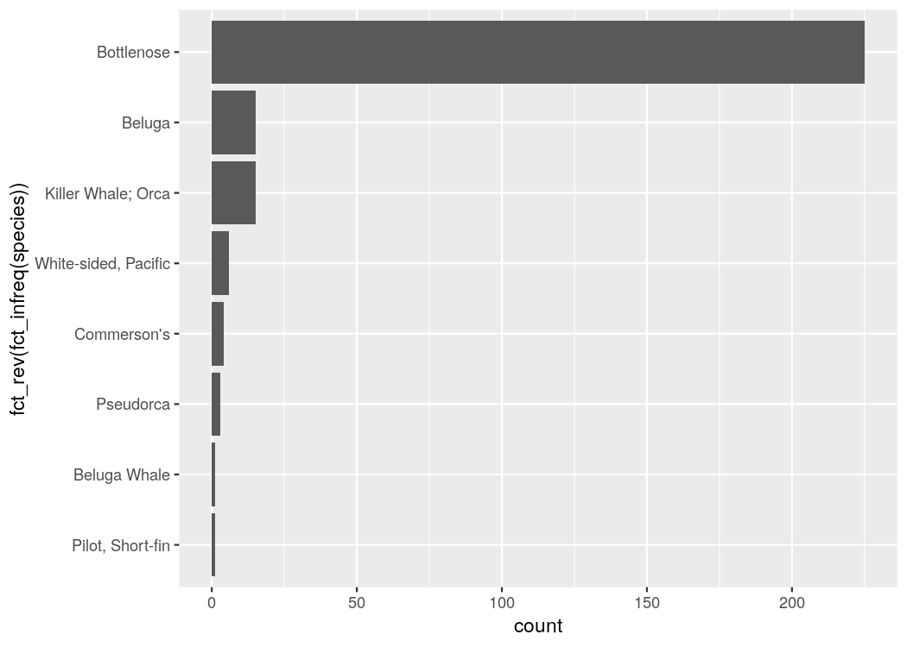<!-- -->

We can see that a vast majority of the animals in the dataset are
bottlenose dolphins – so much of a majority, in fact, that they dwarf
the population size of all the other species. Let’s just focus on
bottlenose dolphins, belugas, and killer whales/orcas for now.

``` r
common_species <- c("Killer Whale; Orca", "Bottlenose", "Beluga")

fertile_cetaceans %>% 
  filter(species %in% common_species) %>% 
  drop_na(origin_date, num_progeny) %>% 
  ggplot(aes(num_progeny)) + 
  geom_bar(aes(fill = species), position = "dodge", binwidth = 1) + 
  labs(
    title = "Number of Progeny by Species", 
    y = "Frequency", 
    x = "Number of progeny"
  )
```

    ## Warning: `geom_bar()` no longer has a `binwidth` parameter. Please use
    ## `geom_histogram()` instead.

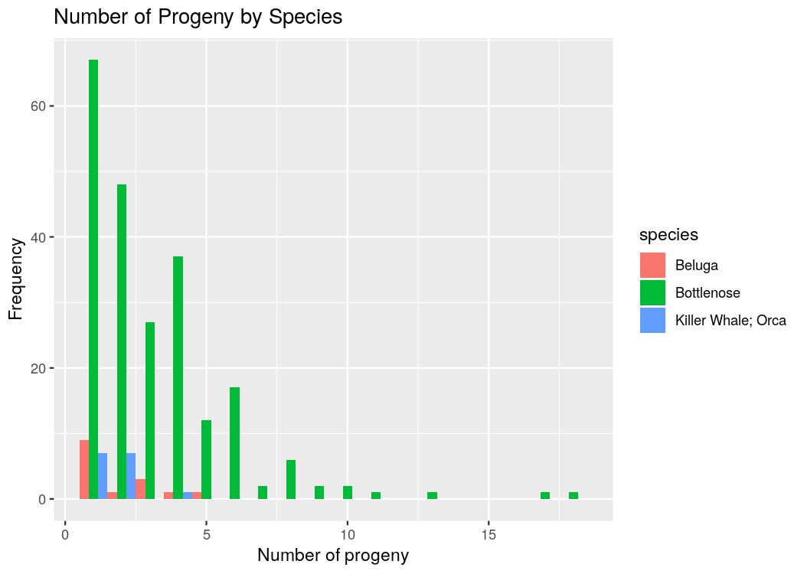<!-- -->

``` r
fertile_cetaceans %>% 
  filter(species %in% common_species) %>% 
  drop_na(origin_date, num_progeny) %>% 
  ggplot(aes(num_progeny)) + 
  geom_bar(aes(fill = sex), position = "dodge", binwidth = 1) + 
  labs(
    title = "Number of progeny by sex", 
    y = "Frequency", 
    x = "Number of Progeny"
  )
```

    ## Warning: `geom_bar()` no longer has a `binwidth` parameter. Please use
    ## `geom_histogram()` instead.

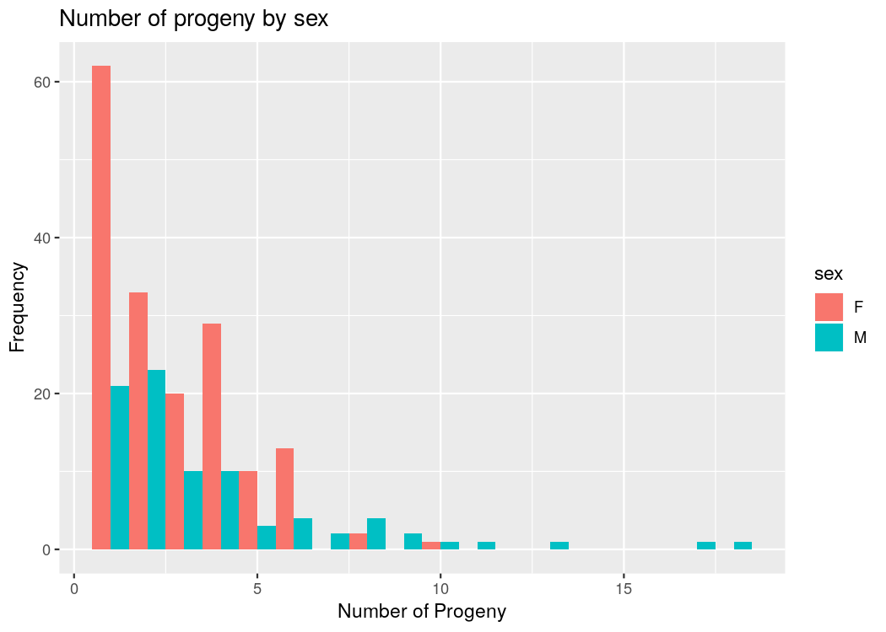<!-- -->

From the first bar plot above, we can see that the distribution of
number of progeny among the three most common species has a similar
shape. From the second plot, we can see that, on the whole, female
cetaceans tend bear more children than the fathers sire. However, one
must note that the cetaceans with the greatest number of progeny
fostered are all male, probably because of the ease with which
caretakers can distribute male sperm to females.

``` r
fertile_cetaceans %>% 
  ggplot(aes(sex)) + 
  geom_bar()
```

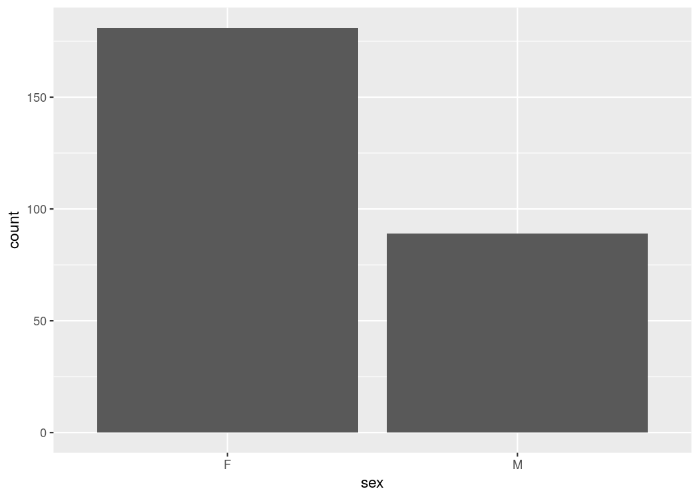<!-- -->

We see from the plot above that there are actually far more female
captive cetaceans than male ones, more than double\! When we compare the
number of progeny coming from each of the two sexes, we should probably
be taking the overall number of cetaceans of that sex into account.

``` r
all_cetacean_data %>% 
  filter(
    !acquisition %in% c("Stillbirth", "Miscarriage", "Unknown"), 
    sex != "U"
  ) %>% 
  ggplot(aes(acquisition)) + 
  geom_bar(aes(fill = sex), position = "dodge")
```

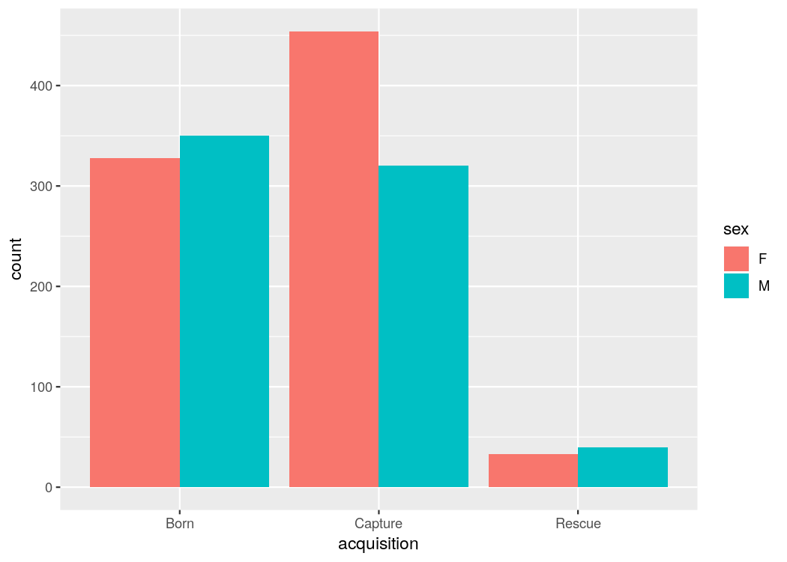<!-- -->

The above graph shows us that the total number of cetaceans born and
rescued is almost equally distributed between the two sexes, with
slightly over a hundred more female cetaceans captured than male
cetaceans. This does not seem to explain the incongruency between the
number of cetaceans produced by male versus female cetaceans.

``` r
fertile_cetaceans %>% 
  filter(num_progeny > 10) %>% 
  arrange(name)
```

    ## # A tibble: 4 x 6
    ##   name      species    num_progeny sex   origin_date acquisition
    ##   <chr>     <chr>            <int> <chr> <date>      <chr>      
    ## 1 capricorn Bottlenose          18 M     1972-12-15  Capture    
    ## 2 crunch    Bottlenose          17 M     1982-04-16  Capture    
    ## 3 hekili    Bottlenose          11 M     1989-11-24  Capture    
    ## 4 lester    Bottlenose          13 M     1972-12-15  Capture

## Plotting family trees

We will use the `ggenealogy` package to make a family tree of all the
cetaceans we know of. We can start with orcas, and remove those with
duplicate names (because we don’t know whate else to do with them).
[`ggenealogy`](https://cran.r-project.org/web/packages/ggenealogy/vignettes/ggenealogy.pdf)
requires a data frame with the following variables: `child`, `devYear`,
`yield`, `yearImputed`, and `parent`.

``` r
genealogy <- 
  all_cetacean_data %>% 
  distinct(name, .keep_all = TRUE) %>% 
  mutate_at(vars(name, mother, father), str_to_title) %>% 
  pivot_longer(cols = c(mother, father), names_to = "relation", values_to = "parent") %>% 
  transmute(
    child = name, 
    devYear = birth_year %>% year(), 
    yield = NA, 
    yearImputed = !is.na(devYear), 
    parent,
    species
  ) %>% 
  arrange(child, parent)
```

Unfortunately, the creators of `ggenealogy` were not in on the
tidyverse, and many of their functions do not utilize the power of the
tidyverse to its full ability. In particular, I would really like to
update a key plotting function, `plotAncDes(...)`. Here is my version, I
will call it `plotFamilyTree()`:

``` r
plotFamilyTree <- 
  function(v1, geneal, m_anc = 3, m_des = 3, v_color = "#D35C79") {
    geneal %>% 
      drop_na(parent) %$% 
      buildAncDesTotalDF(v1, geneal, m_anc, m_des) %>% 
      as_tibble() %>% 
      mutate(is_v1 = label2 == v1) %>% 
      ggplot() +
      geom_text(
        aes(x = x, y = y, label = label2, size = size, color = is_v1),
        vjust = -0.25,
        hjust = 0.5,
        show.legend = FALSE
      ) + 
      geom_segment(aes(x = xstart, y = ystart, xend = xend, yend = yend)) +
      # Draw the underline of the variety
      geom_segment(aes(x = xend, y = yend, xend = branchx, yend = branchy)) +
      scale_size_continuous(range = c(3,3), guide = "none") +
      scale_color_manual(values = c(`TRUE` = v_color, `FALSE` = "black")) + 
      theme_bw() +
      theme(
        panel.grid.major = element_blank(),
        panel.grid.minor = element_blank(),
        axis.text = element_blank(),
        axis.ticks = element_blank()
      ) +
      labs(
        title = str_glue("Family tree of {v1}"),
        x = NULL,
        y = NULL
      )
  }
```

The function `family_trees()` plots family trees in `geneal` for
individuals who have at most `max_anc` ancestors and at least `min_desc`
descendants.

``` r
family_trees <- function(geneal, min_desc = 3, max_anc = 0, root_color = "#1F5E9C") {
  geneal %>% 
    distinct(parent) %>% 
    filter(!is.na(parent)) %>% 
    mutate(
      num_anc = map_int(parent, ~ nrow(getAncestors(., geneal, 100))),
      num_desc = map_int(parent, ~ nrow(getDescendants(., geneal, 100)))
    )  %>% 
    filter(num_anc <= max_anc, num_desc >= min_desc) %>% 
    pull(parent) %>% 
    map(~ plotFamilyTree(., geneal, 100, 100, root_color)) %>% 
    walk(print)
}
```

### Orcas

``` r
orcas <- 
  genealogy %>% 
  filter(species == "Killer Whale; Orca")
```

Now that the data is in the correct format, let’s have some fun checking
out everyone’s families. First, let’s test `ggenealogy`’s capability to
show the family tree of any single individual. We will start with the
male orca “Tilikum”, the subject of *Blackfish*, who is famous for
having killed multiple human trainers. He was caught in Vancouver as a
calf and has been in captivity for most of his life. As they covered in
the documentary, he has fathered many, many of the orcas in captivity;
from the below plot, we can see that this is absolutely true\!

``` r
plotFamilyTree("Tilikum", orcas) + 
  labs(title = "Tilikum's Family Tree") 
```

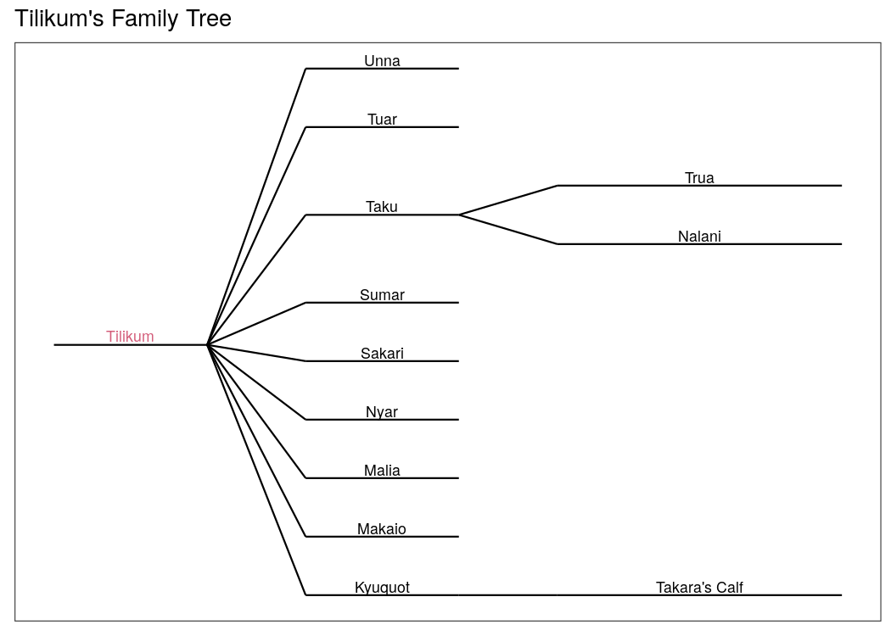<!-- -->

The `getBasicStatistics()` function from `ggenealogy` is helpful for
getting a general sense of the “quality” of our descendence data,
telling us how much we will be able to glean from the child-parent
relationships within it.

``` r
ig <- dfToIG(orcas)
getBasicStatistics(ig)
```

    ## $isConnected
    ## [1] FALSE
    ## 
    ## $numComponents
    ## [1] 23
    ## 
    ## $avePathLength
    ## [1] 3.440457
    ## 
    ## $graphDiameter
    ## [1] 8
    ## 
    ## $numNodes
    ## [1] 64
    ## 
    ## $numEdges
    ## [1] 53
    ## 
    ## $logN
    ## [1] 4.158883

The data seems surprisingly high-quality. In particular, I am suprised
that the average path length in the graph is more than three\!

Now, let’s check out the family trees of the “heads” of the families
within the orca population.

``` r
family_trees(orcas)
```

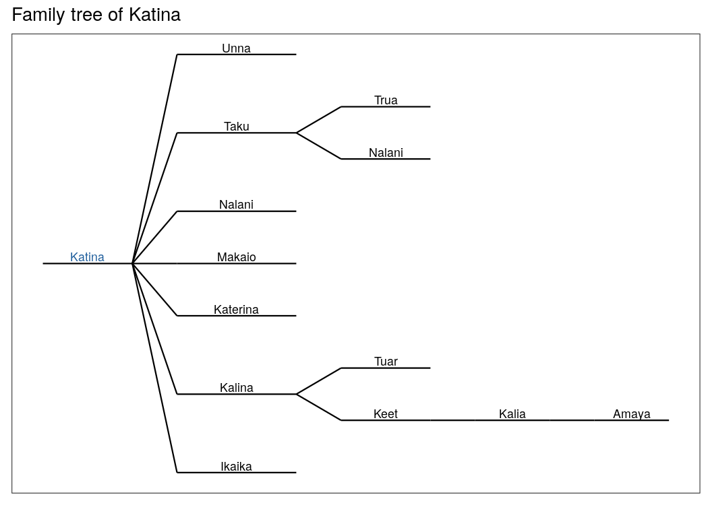<!-- -->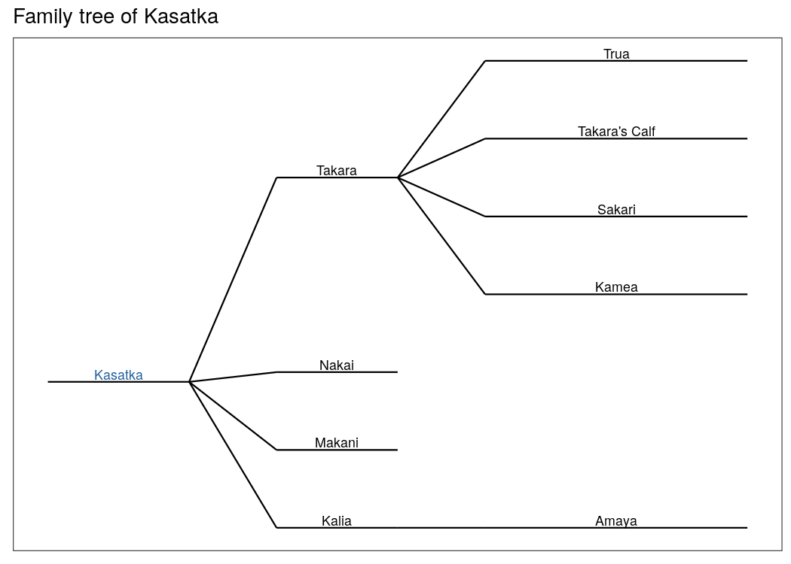<!-- --><!-- --><!-- --><!-- -->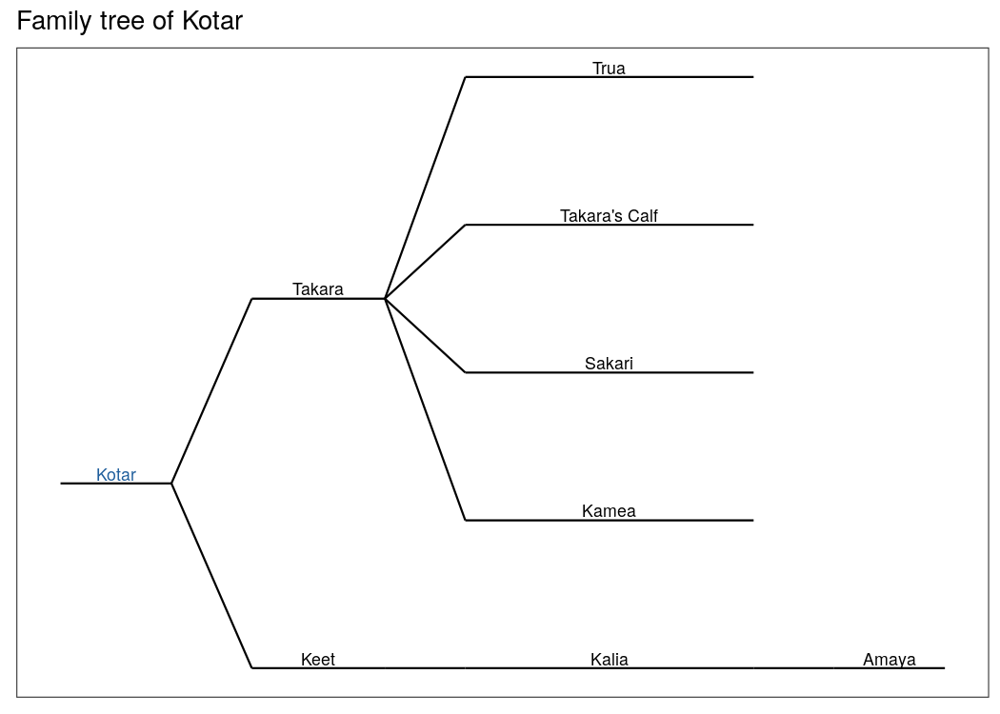<!-- --><!-- --><!-- -->

When we inspect all of the family trees, we see that Tilikum’s breeding
record is really quite unique. He was seriously a workhorse for these
breeding programs, and has many more descendants than any other animal.

### Dolphins

``` r
dolphins <- 
  genealogy %>% 
  filter(species == "Bottlenose") 
```

``` r
family_trees(dolphins, min_desc = 30)
```

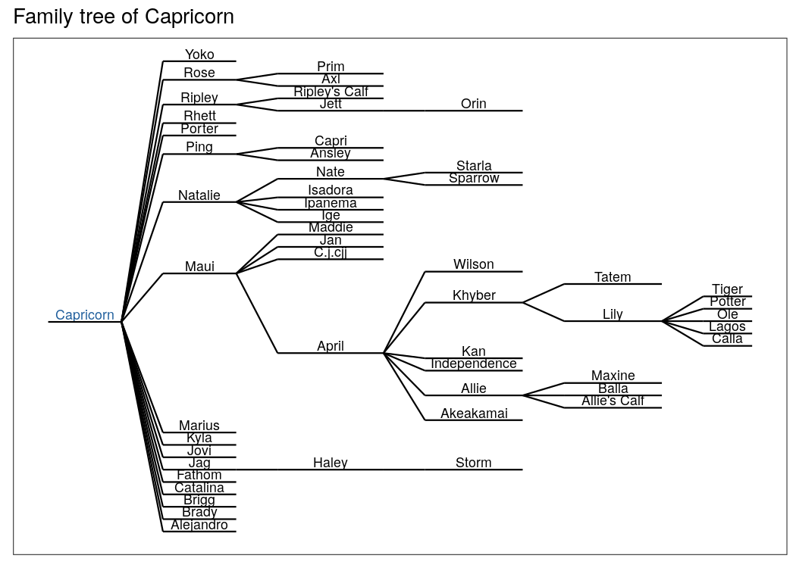<!-- -->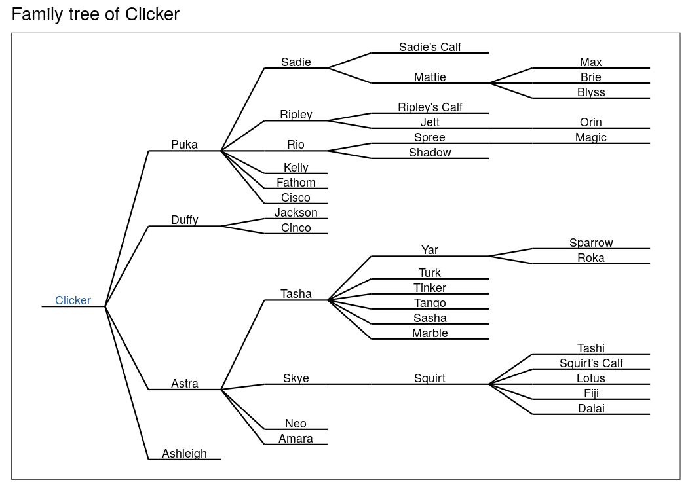<!-- -->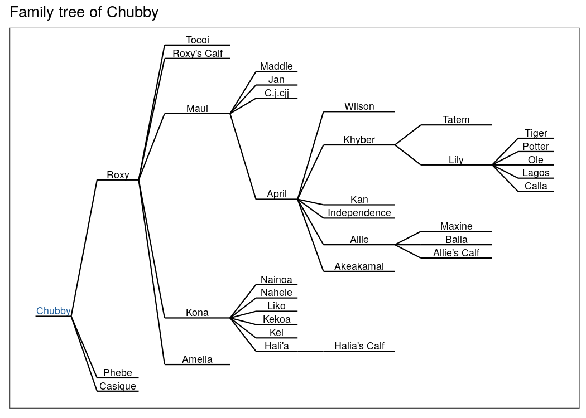<!-- -->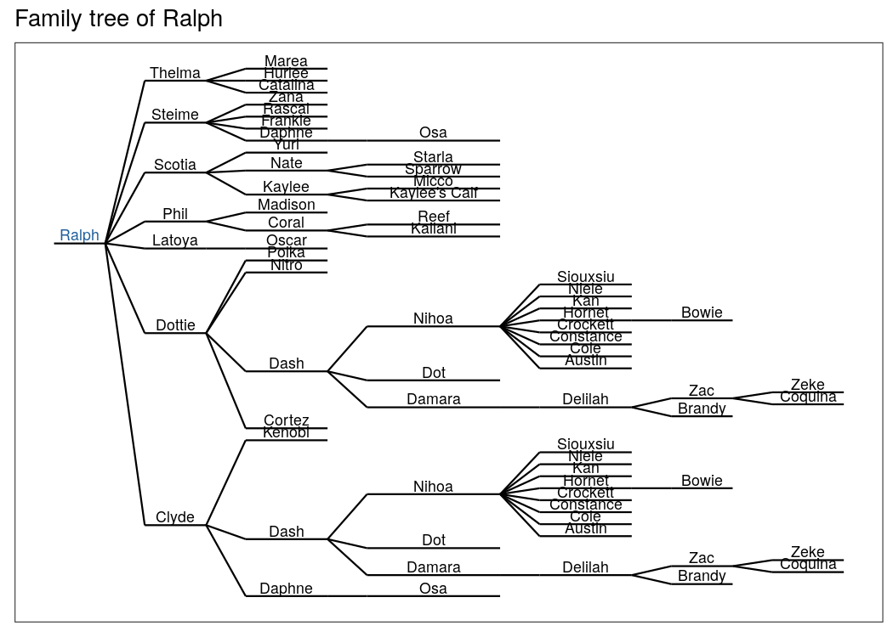<!-- -->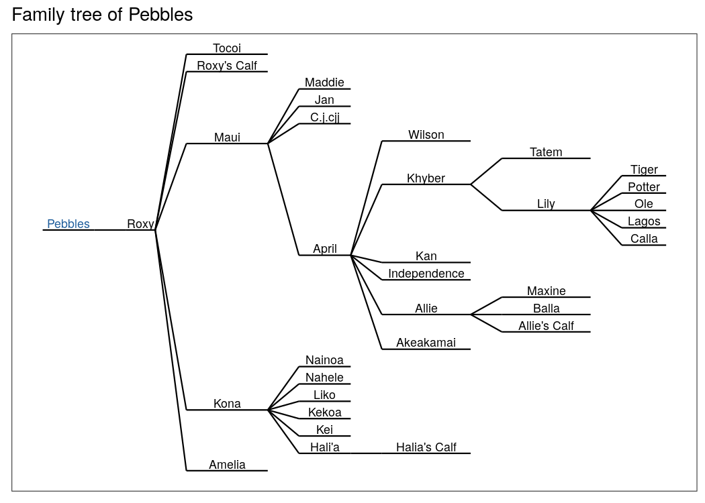<!-- -->
