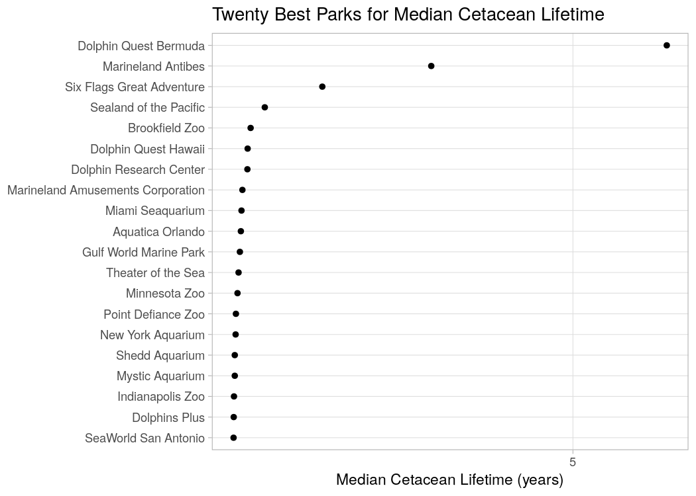

Parks
================
Callan Hoskins
2020-03-08

  - [Families within Captive Cetacean
    Populations](#families-within-captive-cetacean-populations)
      - [Data cleaning](#data-cleaning)
  - [Parks](#parks)
      - [Cetaceans with high numbers of
        transfers](#cetaceans-with-high-numbers-of-transfers)
      - [Cetacean Lifetime by Location](#cetacean-lifetime-by-location)

# Families within Captive Cetacean Populations

``` r
# Read in data on individual cetaceans
all_cetacean_data <- 
  read_rds(all_cetacean_data_file_path)
```

We now want to inspect some of the family ties between cetaceans in
captivity. But first, we have to make sure that our data is clean.

## Data cleaning

These animals are connected not by unique identifiers but by their
names, some of which may be spelled incorrectly. We have to make sure
that each `name` is unique to one animal.

``` r
all_cetacean_data <-
  all_cetacean_data %>% 
  rename(
    "id" = X1
  ) %>% 
  mutate(
    name = str_to_lower(name), 
    mother = str_to_lower(mother), 
    father = str_to_lower(father)
  ) %>% 
  filter(!name %in% na_names)
```

``` r
duplicate_entries <-
  all_cetacean_data %>% 
  filter(!str_detect(name, "no |fetus|none|unk")) %>% 
  mutate(
    name = case_when(
      name == "(joe)" ~ "joe", 
      name == "(rosalie)" ~ "rosalie", 
      TRUE ~ name
    )
  ) %>% 
  count(name, species, entry_date, status_date) %>% 
  filter(n >= 2) %>% 
  pull(name)

duplicate_entries
```

    ##  [1] "alia"      "bodie"     "kai'nalu"  "khloe"     "lazarus"   "liko"     
    ##  [7] "mirabella" "misty"     "noelani"   "orion"     "ping"      "sonny"    
    ## [13] "spanky"    "splash"    "spray"

There are almost 20 animals that have more than one entry for their
`name` / `entry_date` combination. I will visually inspect these
duplicates and select the entry for each that seems most accurate.

``` r
all_cetacean_data %>% 
  filter(name %in% duplicate_entries) %>% 
  select(name, id, entry_date, official_id, everything()) %>% 
  arrange(name, entry_date)
```

    ## # A tibble: 52 x 22
    ##    name     id entry_date official_id species sex   accuracy birth_year
    ##    <chr> <dbl> <date>     <chr>       <chr>   <chr> <chr>    <date>    
    ##  1 alia    199 2007-12-04 NOA0006436… Bottle… F     a        2007-01-01
    ##  2 alia    607 2007-12-04 NOA0006436… Bottle… F     a        2007-01-01
    ##  3 bodie   236 2010-06-07 NOA0006642… Bottle… M     a        2010-01-01
    ##  4 bodie   609 2010-06-07 NOA0006642… Bottle… M     a        2010-01-01
    ##  5 bodie   304 2014-10-17 NOA0010183… Bottle… M     a        2014-01-01
    ##  6 kai'…    66 1996-10-03 NOA0003746… Bottle… M     a        1996-01-01
    ##  7 kai'…   603 1996-10-03 NOA0003746… Bottle… M     a        1996-01-01
    ##  8 khloe   201 2008-04-18 NOA0006454… Bottle… F     a        2008-01-01
    ##  9 khloe   608 2008-04-18 NOA0006454… Bottle… F     a        2008-01-01
    ## 10 laza…   511 2002-07-19 NOA006134,… Bottle… M     e        NA        
    ## # … with 42 more rows, and 14 more variables: acquisition <chr>,
    ## #   origin_date <date>, origin_loc <chr>, mother <chr>, father <chr>,
    ## #   transfers <chr>, currently <chr>, region <chr>, status <chr>,
    ## #   status_date <date>, cod <chr>, notes <chr>, transfer_date <date>,
    ## #   transfer <chr>

I will have to fix some of this data manually. I had to find some
updates online. Here is a summary of my changes:

  - “Alia” the bottlenose dolphin passed away at Dolphinaris Arizona on
    May 22, 2018. I am combining her information into one updated entry.
  - “Bodie” the bottlenose dolphin passed away at Dolphinaris Arizona on
    September 23, 2017. I am combining his information into one updated
    entry.
  - There is a second bottlenose dolphin named “Bodie” who was born in
    2014 and is currently at Seaworld San Diego who should still be
    included in the data.
  - “Kai’nalu” the bottlenose dolphin passed away at Dolphinaris Arizona
    on January 31, 2019. I am combining his information into one updated
    entry.
  - “Khloe” the bottlenose dolphin passed away at Dolphinaris Arizona on
    December 31, 2019. I am combining her information into one updated
    entry.
  - Neither of the two entries for “Lazarus” seems to give more
    information. I am arbitrarily dropping the entry with `id = 1810`.
  - “Liko” the bottlenose dolphin at Dolphinaris Arizona is currently
    still alive and at Dolphinaris Arizona. I will update this
    information, collected 2/2/2019. I will drop Liko’s unknown `status`
    entry.
  - There is a second bottlenose dolphin named “Liko” unrelated to the
    one at Dolphinaris Arizona. I will keep his entry as-is.
  - The entry for “Mirabella” with `id = 1691` has information about
    Mirabella’s mother and father, so I will drop the other one (`id
    = 1069`).
  - There are two nearly-identical entries for a dolphin named “Misty”
    who was born 1980-07-27 and died 2005-01-18. One of the entries says
    that his father was “Spray” and the other one has `NA` for that
    entry, so we will choose the more complete entry (remove `id
    = 2011`).
  - “Noelani” the dolphin at Dolphinaris Arizona was reportedly alive
    2/2/2019. I will combine her repetitive entries into one updated
    one.
  - There is a second, unrelated “Noelani” who I will not edit.
  - “Orion” the bottlenose dolphin born in 1982 seems to have more
    information in the entry with `id = 780`. I will drop his entry with
    `id = 1656`.
  - There is a second, seemingly unrelated bottlenose dolphin named
    “Orion” whose information I will not edit.
  - “Ping” of Dolphinaris Arizona was reportedly alive 2/2/2019. I will
    combine her repetitive entries into one.
  - “Sonny” the bottlenose dolphin of Dolphinaris Arizona was reportedly
    alive 2/2/2019. I will combine his repetitive entries into one
    updated entry and leave the rest of the separate “Sonny” entries
    alone.
  - There are three repetitive entries for the bottlenose dolphin named
    “Spanky,” and one is far more informative than the others. I will
    remove the two that are uninformative.
  - There are two repetitive entries for the bottlenose dolphin named
    “Splash,” and one is more informative than the other. I will
    remove the one that is uninformative. The remaining dolphins named
    “Splash” are unique.
  - There are two repetitive entries for the bottlenose dolphin named
    “Spray,” and one is more informative than the other. I will remove
    the one that is uninformative. The remaining dolphins named “Spray”
    are unique.

<!-- end list -->

``` r
all_cetacean_data <-
  all_cetacean_data %>% 
  filter(
    !(name == "alia" & status == "Unknown"), # drop one of alia's entries
    !(name == "bodie" & id != 304 & status == "Unknown"), # drop one of bodie1's entries
    !(name == "kai'nalu" & id != 603), # drop one of kai'nalu's entries
    !(name == "khloe" & id != 608), # drop one of khloe's entries, 
    !id == 1810, # drop one of Lazarus's entries, 
    !(name == "liko" & status == "Unknown"), # drop one of liko's entries
    !(name == "mirabella" & id == 1069), # drop one of Mirabella's entries
    !(name == "misty" & id == 2011), # drop one of misty's entries
    !(name == "noelani" & status == "Unknown"), # drop one of noelani's entries
    !(name == "orion" & id == 1656), # drop one of orion's entries
    !(name == "ping" & status == "Unknown"), # drop one of ping's entries
    !(name == "sonny" & status == "Unkown" & id == 605), # drop one of sonny's entries
    !(name == "spanky" & id != 751), # remove two repetitive entries for spanky
    !(name == "splash" & id == 1807), # remove a repetitive entry for splash
    !(name == "spray" & id == 2176)
  ) %>% 
  mutate(
    status = if_else(name == "alia", "Died", status), # update alia's info
    status_date = 
      if_else(name == "alia", make_date(2018L, 5L, 22L), status_date), # update alia's info
    status = if_else(name == "bodie", "Died", status), # update bodie's info
    status_date = 
      if_else(name == "bodie", make_date(2017L, 9L, 23L), status_date), # update bodie's info
    status = if_else(name == "kai'nalu", "Died", status), # update kai'nalu's info
    status_date = 
      if_else(name == "kai'nalu", make_date(2019L, 1L, 31L), status_date), #update kai'nalu's info
    status = if_else(name == "khloe", "Died", status), # update khloe's info
    status_date = 
      if_else(name == "khloe", make_date(2018L, 12L, 1L), status_date), #update khloe's info
    status = if_else(name == "liko", "Alive", status), # update liko's status
    status_date = 
      if_else(name == "liko", make_date(2019L, 2L, 2L), status_date), # update liko's status
    status_date = 
      if_else(
        name == "noelani" & id == 241, 
        make_date(2019L, 2L, 2L), 
        status_date
      ), # update noelani's info
    status = if_else(name == "ping", "Alive", status), # update ping's info
    status_date = 
      if_else(name == "ping", make_date(2019L, 2L, 2L), status_date), # update ping's info
    status_date = 
      if_else(
        name == "sonny" & id == 213, 
        make_date(2019L, 2L, 2L), 
        status_date
      ), # update sonny's info
  ) %>% 
  distinct(name, .keep_all = TRUE)
```

In case you were wondering about the number of deaths/unknown
information at Dolphinaris Arizona, the facility closed in 2019 due to
the fact that four of their eight dolphins died within the first two
years of their opening. You can read about it
[here](!https://www.abc15.com/news/region-northeast-valley/scottsdale/dolphinaris-arizona-temporarily-closing-after-death-of-facilitys-fourth-dolphin).

# Parks

Another of the most potentially interesting things about this data is
the opportunity to inspect the track records of many parks that keep
cetaceans. As popular films like *Blackfish* and *Free Willy* have
exposed, the conditions that cetaceans live in in parks like Seaworld is
not good enough for them to thrive. We saw an example of this
mismanagement (or at least bad luck) in the data I corrected regarding
the dolphins from Dolphinaris Arizona, which lost four of its eight
dolphins within four years of opening. What parks are the best / worst
with regards to how their animals live and breed? I am not a marine
biologist, but I know that lifespan and breeding record are two
rudimentary ways to measure an animal’s quality of life in captivity.

``` r
transfer_data <- 
  all_cetacean_data %>% 
  select(
    -c(
      transfer, 
      transfer_date, 
      notes, region, 
      status_date, 
      cod, 
      mother, 
      father, 
      accuracy, 
      id, 
      official_id
    )
  ) %>% 
  # standardize spellings of Hawaii
  mutate_at(
    vars(origin_loc, currently, transfers), 
    str_replace_all, 
    "Hawai'i", 
    "Hawaii"
  ) %>% 
  # standardize spellings of SeaWorld
  mutate_at(
    vars(origin_loc, currently, transfers), 
    str_replace_all, 
    "[Ss]ea[ ]?[Ww]orld", 
    "SeaWorld"
  )

transfer_data %>% 
  pull(transfers) %>% 
  head()
```

    ## [1] NA                                                                                                                                                                                                                                                                                                                                                                                                                                                                                                   
    ## [2] NA                                                                                                                                                                                                                                                                                                                                                                                                                                                                                                   
    ## [3] "SeaWorld San Diego to SeaWorld Aurora (??-???-1983) to SeaWorld San Diego (??-???-1983) to SeaWorld Aurora (??-???-1985) to SeaWorld San Diego (??-???-1985) to SeaWorld Orlando (< Nov 1987) to SeaWorld San Antonio (< 1991) to Busch Gardens Tampa (1991 / 1992) to National Aquarium in Baltimore (11-Oct-1992) to SeaWorld Aurora (22-Oct-1997) to SeaWorld San Antonio (26-Apr-1998) to SeaWorld Orlando (03-Apr-2000) to Busch Gardens Tampa (28-Sep-2000) to SeaWorld Orlando (19-Apr-2001)"
    ## [4] "SeaWorld Orlando to SeaWorld San Diego (< Aug 1986)"                                                                                                                                                                                                                                                                                                                                                                                                                                                
    ## [5] "SeaWorld San Diego to SeaWorld Aurora (< 1987) to SeaWorld San Antonio (13-Oct-1990?)"                                                                                                                                                                                                                                                                                                                                                                                                              
    ## [6] "SeaWorld San Diego to New England Aquarium (22-Oct-1986) to U.S. Navy MMP (17-Nov-1987)"

The first problem is how to extract information about these transfers
from these strings… we are going to need some serious regex here\!

``` r
transfer_data <- 
  transfer_data %>% 
  mutate(location = str_split(transfers, " to ")) %>% 
  unnest(location) %>% 
  mutate(
    location = 
      case_when(
        is.na(location) & origin_loc == currently ~ origin_loc, 
        is.na(location) & origin_loc == "Unknown" ~ currently, 
        name == "hapa" ~ "U.S. Navy MMP",
        TRUE ~ location
      ), 
    transfer_year = 
      if_else(
        str_detect(location, "\\d{4}"), 
        str_extract(location, "\\d{4}") %>% as.integer(), 
        origin_date %>% year() %>% as.integer()
      ), 
    location = str_replace(location, " \\(.*\\).*", "")
  ) %>% 
  mutate_at(vars(location, origin_loc, currently), standardize_locs) %>% 
  filter(location != "") %>% 
  group_by(name) %>% 
  mutate(transfer_no = seq(1, n())) %>% 
  ungroup() %>% 
  select(
    transfer_no, 
    name, 
    location, 
    transfers, 
    origin_loc, 
    currently, 
    everything()
  )
```

## Cetaceans with high numbers of transfers

``` r
transfer_data %>% 
  group_by(name) %>% 
  summarize(n_locs = n()) %>% 
  ggplot(aes(n_locs)) + 
  geom_histogram(binwidth = 1)
```

<!-- -->

We can see that the vast majority of captive cetaceans were transfered
less than five times in their lives. Let’s take a look at the cetaceans
that were transfered the most:

``` r
transfer_data %>% 
  group_by(name) %>% 
  mutate(n_locs = n()) %>% 
  filter(n_locs > 10) %>% 
  select(name, species, origin_date, birth_year, entry_date, status, acquisition, n_locs) %>% 
  distinct()
```

    ## # A tibble: 8 x 8
    ## # Groups:   name [8]
    ##   name    species    origin_date birth_year entry_date status acquisition n_locs
    ##   <chr>   <chr>      <date>      <date>     <date>     <chr>  <chr>        <int>
    ## 1 starbu… Bottlenose 1978-05-13  1978-01-01 1978-05-13 Alive  Born            14
    ## 2 molly   Bottlenose 1968-01-01  1961-01-01 1968-01-01 Alive  Capture         12
    ## 3 lester  Bottlenose 1972-12-15  1971-01-01 1972-12-15 Alive  Capture         11
    ## 4 kimo    Bottlenose 1988-06-02  1985-01-01 1988-06-02 Alive  Capture         11
    ## 5 sundan… Bottlenose 1988-06-05  1985-01-01 1988-06-05 Died   Capture         11
    ## 6 kenau   Killer Wh… 1976-10-25  1975-01-01 1976-10-25 Died   Capture         14
    ## 7 kahana  Killer Wh… 1977-10-26  1977-01-01 1977-10-26 Died   Capture         12
    ## 8 kilroy  Killer Wh… 1967-02-15  1966-01-01 1967-02-15 Died   Capture         13

This data certainly tells a sad story. Many of these animals lived only
a few years before dying, and they were transfered so many times within
that short span of time. Orcas Kahana, Kilroy, and Kenau lived a year or
less in captivity before passing away, during which time they were
transferred more than ten times. Again, I am no marine biologist, but I
recognize that a transfer puts incredible stress on an animal.

## Cetacean Lifetime by Location

I am interested in seeing how long animals live when they are housed in
certain parks. Our naive first approach below seems to have the fault
that it does not make a difference between the collection site and the
ultimate place where the animals end up. This doesn’t provide much
information about the parks because we have no knowledge or control over
the place where the animals were originally captured.

``` r
transfer_data %>% 
  mutate(capt_lifetime = (birth_year %--% entry_date) %>% time_length("years")) %>% 
  drop_na(capt_lifetime) %>% 
  group_by(location) %>% 
  summarize(med_capt_lifetime = median(capt_lifetime)) %>% 
  top_n(20, med_capt_lifetime) %>% 
  ggplot(aes(fct_reorder(location, med_capt_lifetime), med_capt_lifetime)) + 
  geom_col() + 
  coord_flip()
```

<!-- -->

``` r
transfer_data_parks <- 
  transfer_data %>% 
  filter(!map_lgl(location, ~ str_detect(., natural_locs) %>% any()))
transfer_data_parks %>% 
  count(location) %>% 
  arrange(location)
```

    ## # A tibble: 122 x 2
    ##    location                       n
    ##    <chr>                      <int>
    ##  1 Animal Wonderland              2
    ##  2 Aquatic Mammal Enterprises     3
    ##  3 Aquatica Orlando               7
    ##  4 Audubon Zoo                    3
    ##  5 Brookfield Zoo                40
    ##  6 Busch Gardens Tampa           16
    ##  7 Clearwater Marine Aquarium    10
    ##  8 Discovery Cove                91
    ##  9 Dolfinarium Harderwijk         5
    ## 10 Dolphin Academy                1
    ## # … with 112 more rows

``` r
transfer_data_parks %>% 
  mutate(capt_lifetime = (birth_year %--% entry_date) %>% time_length("years")) %>% 
  drop_na(capt_lifetime) %>% 
  group_by(location) %>% 
  summarize(med_capt_lifetime = median(capt_lifetime)) %>% 
  top_n(20, med_capt_lifetime) %>% 
  ggplot(aes(fct_reorder(location, med_capt_lifetime), med_capt_lifetime)) + 
  geom_point() + 
  coord_flip() + 
  scale_y_continuous(breaks = scales::breaks_width(5)) + 
  theme_light() + 
  labs(
    title = "Twenty Best Parks for Median Cetacean Lifetime", 
    y = "Median Cetacean Lifetime (years)", 
    x = NULL
  )
```

<!-- -->
