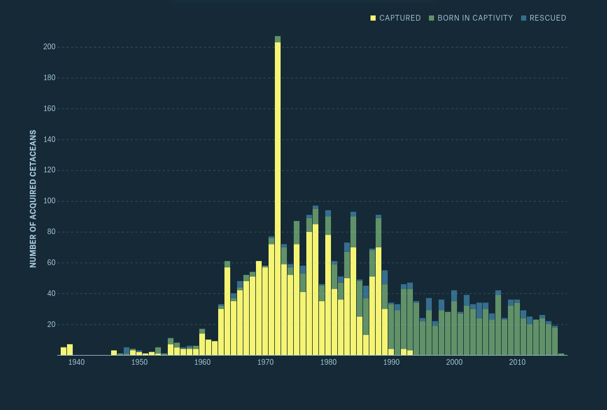
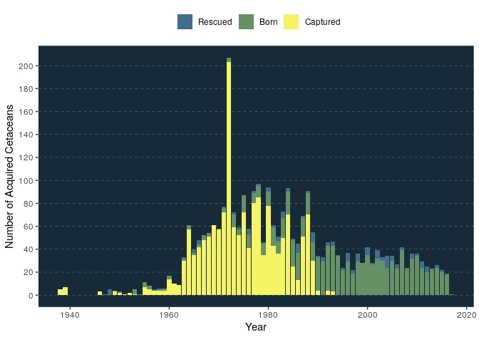
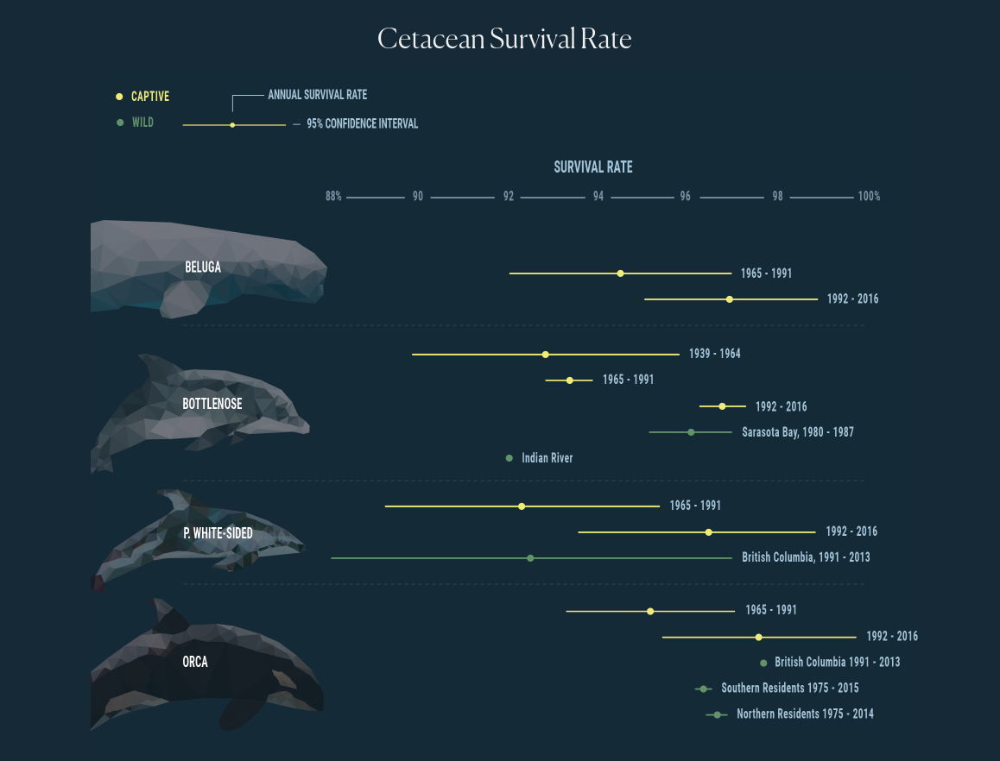
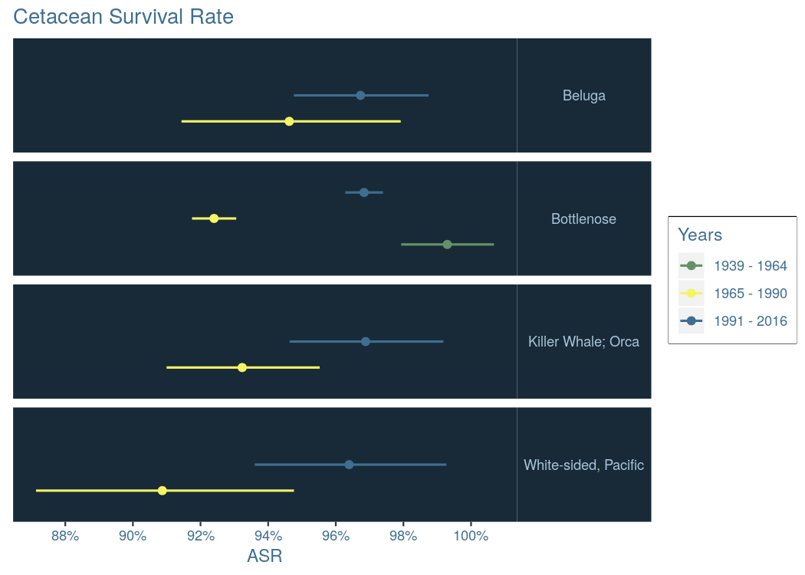
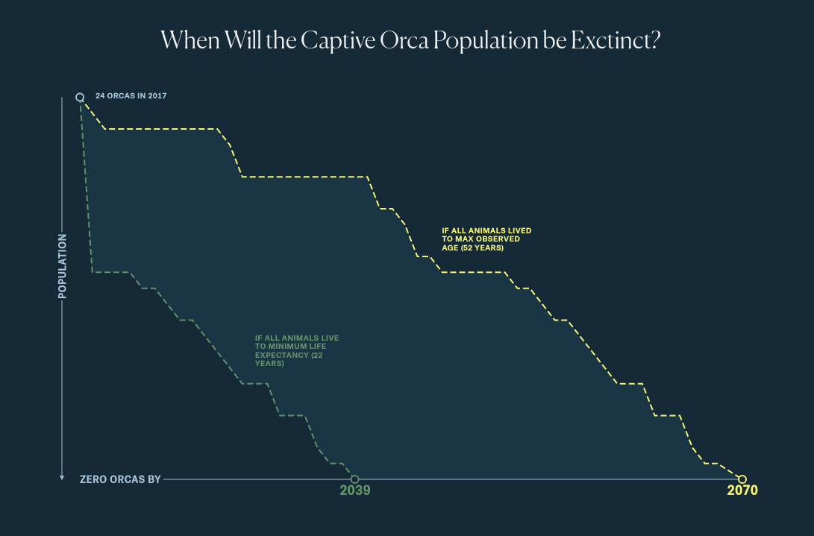
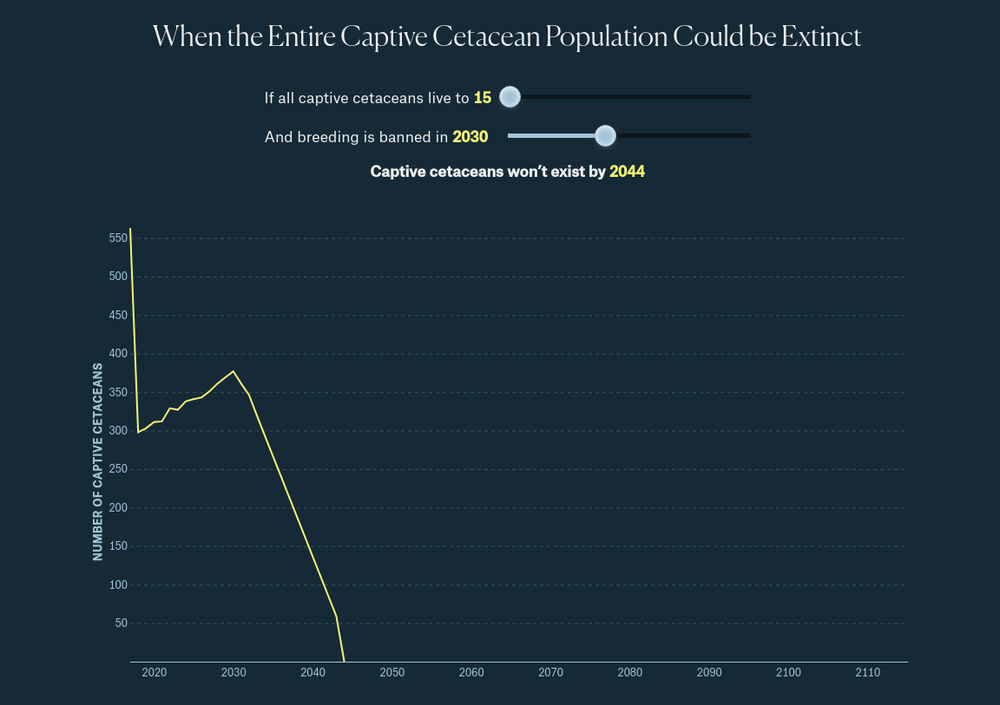

Progress Report 1
================
Callan Hoskins
2020-02-03

  - [Task 1: Histogram of Acquisitions Over
    Time](#task-1-histogram-of-acquisitions-over-time)
  - [Task 2: Life Expectancy for Each
    Animal](#task-2-life-expectancy-for-each-animal)
  - [Task 3: When Will the Captive Orca be
    Extinct](#task-3-when-will-the-captive-orca-be-extinct)
  - [Task 4: When Will the Entire Captive Cetacean Population be Extinct
    (interactive)](#task-4-when-will-the-entire-captive-cetacean-population-be-extinct-interactive)

``` r
# Libraries
library(tidyverse)
library(viridis)
library(lubridate)

# Parameters
acquistions_file_path <- here::here("data/acquisitions.rds")
all_cetacean_data_file_path <- here::here("data/all_cetaceans_data.rds")

# Images
acquisitions_over_time_path <- here::here("eda/pr1_acquisitions_over_time.png")
life_exp_path <- here::here("eda/pr1_life_exp.png")
captive_orcas_extinct_path <- here::here("eda/pr1_captive_orcas_extinct.png")
captive_cetaceans_extinct_path <- here::here("eda/pr1_captive_cetaceans_extinct.png")

# palette used by Amber Thomas in her original article 
# https://pudding.cool/2017/07/cetaceans/
ap_blue_dark <- "#182A37"
ap_blue_med <- "#3F6E90"
ap_blue_light <- "#A8C4D9"
ap_green <- "#669166"
ap_yellow <- "#F4F465"
#===============================================================================
acquisitions <- read_rds(acquistions_file_path)
```

## Task 1: Histogram of Acquisitions Over Time

The original author produced this graph of acquisitions over time by
type of acquisition. As part of my first progress report, I will
re-create it:



Now, I can recreate the graph:

``` r
acquisitions %>% 
  mutate(year = make_date(year)) %>% 
  ggplot(
    aes(year, num_cetaceans, 
        fill = factor(source, levels = c("rescue", "born", "captured")))
  ) +
  geom_col(position = "stack") + 
  scale_fill_manual(
    labels = c("born" = "Born", "captured" = "Captured", "rescue" = "Rescued"), 
    values = 
      c("born" = ap_green, "captured" = ap_yellow, "rescue" = ap_blue_med)
  ) + 
  scale_y_continuous(breaks = seq(0, 200, 20)) + 
  labs(
    x = "Year", 
    y = "Number of Acquired Cetaceans", 
    fill = ""
  ) + 
  theme(
    aspect.ratio = 3/5, 
    panel.grid.major.y = 
      element_line(color = ap_blue_light, linetype = "dashed", size = 0.1), 
    panel.grid.minor.y = element_blank(), 
    panel.grid.major.x = element_blank(), 
    panel.grid.minor.x = element_blank(), 
    legend.position = "top", 
    panel.background = element_rect(fill = ap_blue_dark)
  )
```

<!-- -->

*Note*: Improvements on this graph that need to be done:

  - Break x axis by decade (with `scale_x_date()`?)
  - Color the *entire* background including title and axes labels
  - Fix bleeding columns (why do they exist?)

## Task 2: Life Expectancy for Each Animal

I will now reproduce another one of the graphs that Amber Thomas did for
her original analysis of this data, in a section titled “How long do
they live?”. She measures the length of an animal’s life in the same way
most wildlife scients do: by way of Annual Survival Rate (ASR), which is
based on how likely it is that an animal will survive another year. She
looks at the ASR based on animal species and the timeframe in which the
ASR is measured. Amber includes her original `R` code for calculating
the ASR with the data. The below calculations are based on her original,
with small tweaks from myself. She has excellent style\!

Here is the graph to recreate:



``` r
# read in all cetacean data
all_cetacean_data <- read_rds(all_cetacean_data_file_path)

# eras to arrange ASR by
years <- c(1939:1964, 1965:1990, 1991:2017)

# calculate ASR for each era group
year_groups <- 
  as.data.frame(years) %>% 
  mutate(group = ifelse(years < 1985, "A",
                        ifelse(years > 1991, "C", "B")))

animal_days_3 <- 
  all_cetacean_data %>% 
  filter(status == "Alive" | status == "Died",
         !(status == "Died" & is.na(status_date))) %>% 
  mutate(entry_date = ymd(entry_date),
         entry_year = year(entry_date),
         year_group = ifelse(entry_year <= 1964, "A",
                             ifelse(entry_year > 1991, "C", "B")),
         max = ifelse(year_group == "A" & (status_date < ymd("1964-12-31")), "Died", 
                      ifelse(year_group == "B" & (status_date < ymd("1991-12-31")), "Died", ifelse(year_group == "C" & (status_date < ymd("2016-12-31")), "Died", "Survived")))) %>% 
  mutate(max = ifelse(is.na(max), "Survived", max)) %>% 
  mutate(minA = pmin(status_date, ymd("1964-12-31"), na.rm = TRUE),
         minB = pmin(status_date, ymd("1991-12-31"), na.rm = TRUE),
         minC = pmin(status_date, ymd("2016-12-31"), na.rm = TRUE),
         min = if_else(year_group == "A", minA,
                       if_else(year_group == "B", minB,
                               if_else(year_group == "C", minC, ymd("2017-05-01"))))) %>%
  select(-minA, -minB, -minC) %>% 
  mutate(animal_days = min - entry_date) %>% 
  filter(!animal_days < 60) %>% 
  filter(species == "Bottlenose" | species == "Beluga" | species == "Killer Whale; Orca" | species == "White-sided, Pacific") %>% 
  group_by(species, year_group) %>% 
  mutate(total_animal_days = sum(animal_days, na.rm = TRUE)) %>% 
  group_by(species, max, year_group) %>% 
  summarise(sum_animal_days = mean(total_animal_days),
            count = n()) %>% 
  filter(max == "Died") %>% 
  mutate(sum_animal_days = as.numeric(sum_animal_days)) %>% 
  mutate(dsr = 1 - (count / sum_animal_days),
         asr_low = (dsr - (1.96 * (sqrt(dsr * (1 - dsr) / sum_animal_days)))) ^ 365.25,
         asr_high = (dsr + (1.96 * (sqrt(dsr * (1 - dsr) / sum_animal_days)))) ^ 365.25,
         asr = dsr ^ 365.25) %>% 
  ungroup()
```

And here I make the plot:

``` r
animal_days_3 %>% 
  group_by(species) %>% 
  mutate(group_id = row_number()) %>% 
  ggplot(aes(asr_low, group_id)) + 
  geom_segment(
    aes(xend = asr_high, yend = group_id, color = year_group), 
    size = 0.7
  ) + 
  geom_point(aes(asr, group_id, color = year_group), size = 2) + 
  facet_grid(rows = vars(species)) + 
  scale_color_manual(
    labels = c("A" = "1939 - 1964", "B" = "1965 - 1990", "C" = "1991 - 2016"), 
    values = 
      c("A" = ap_green, "B" = ap_yellow, "C" = ap_blue_med)
  ) + 
  scale_x_continuous(
    breaks = seq(0.88, 1, 0.02), 
    labels = scales::percent_format(accuracy = 1)
  ) + 
  coord_cartesian(ylim = c(0, 4)) + 
  labs(
    title = "Cetacean Survival Rate", 
    x = "ASR", 
    color = "Years"
  ) + 
  theme(
    axis.ticks.y = element_blank(), 
    axis.title.y = element_blank(), 
    axis.text.y = element_blank(), 
    strip.text.y = element_text(angle = 0), 
    panel.grid = element_blank(), 
    panel.background = element_rect(fill = ap_blue_dark), 
    strip.background = element_rect(fill = ap_blue_dark), 
    strip.text = element_text(color = ap_blue_light), 
    title = element_text(color = ap_blue_med), 
    axis.text = element_text(color = ap_blue_med), 
    legend.text = element_text(color = ap_blue_med), 
    legend.box.background = element_rect(fill = ap_blue_dark)
  )
```

<!-- -->

I see that Amber Thomas collected extra data on the ASR of these animals
as observed in the wild. For this plot, I did not include this
information, but I think it would be a nice thing to add on in the
coming days.

If I were to improve this graph (and I would like to), I would:

  - Fix the legend so that the colors are displayed against a dark blue
    background (matching the panel background)
  - Ensure that the entire plot’s background is dark blue
  - Add information about wild cetaceans

## Task 3: When Will the Captive Orca be Extinct

Re-create this graph: … **UNFINISHED**



## Task 4: When Will the Entire Captive Cetacean Population be Extinct (interactive)

Re-create this plot: … **UNFINISHED**


