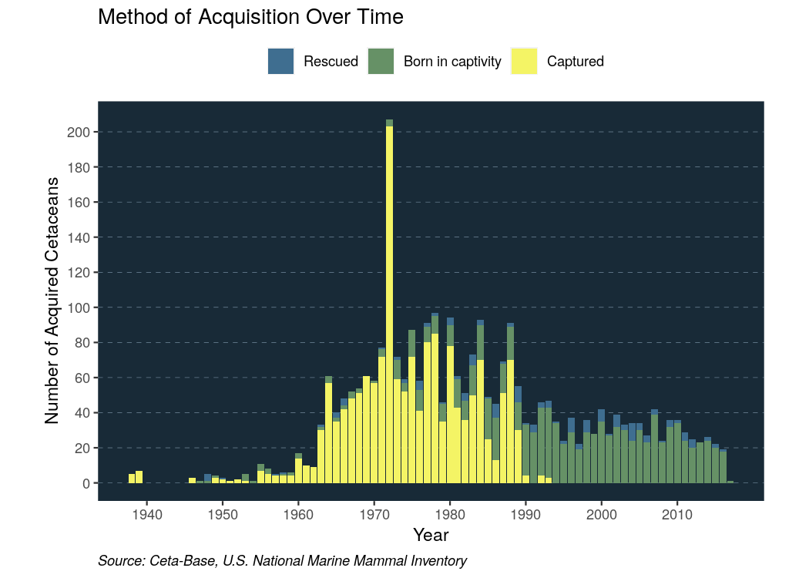
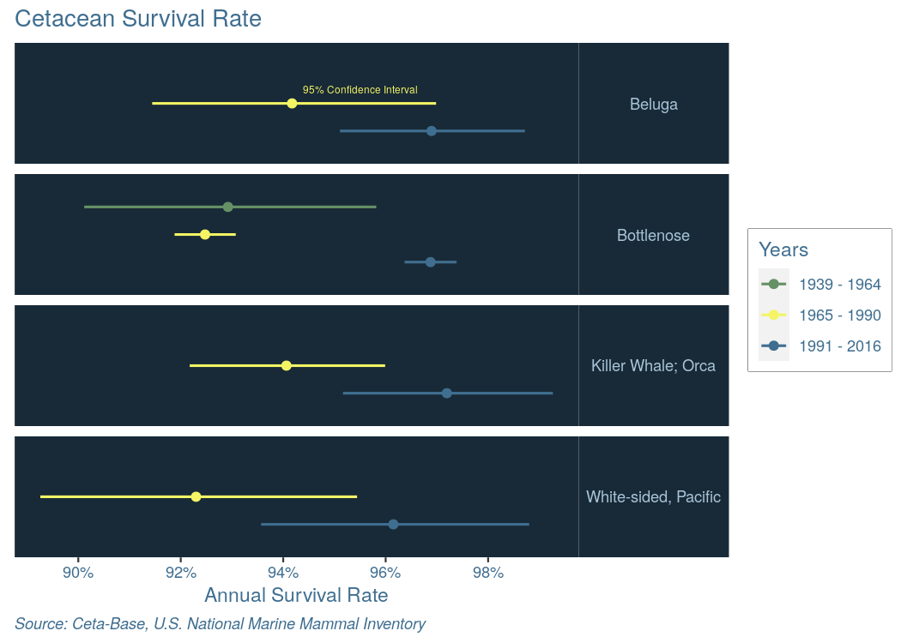
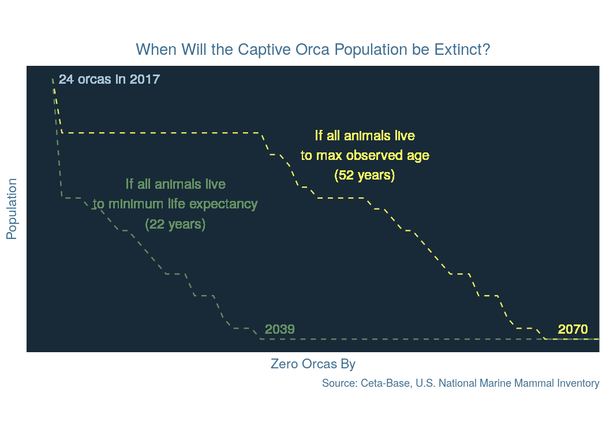
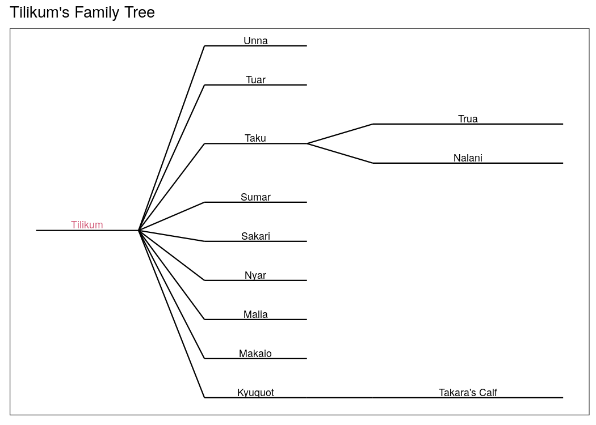
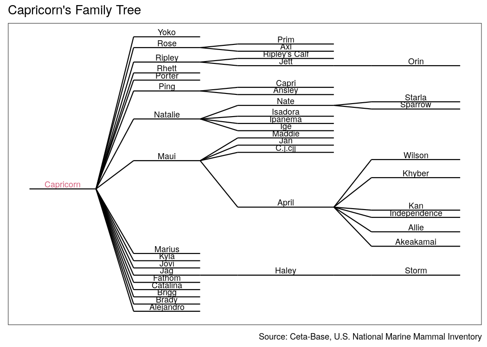
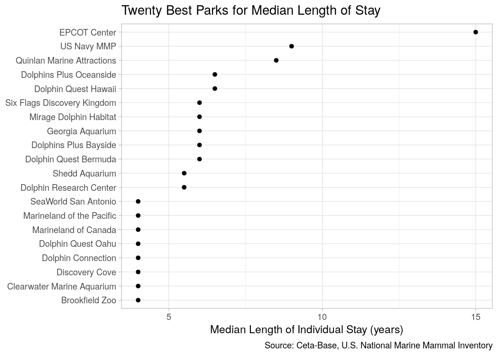

Captive Cetaceans
================
Callan Hoskins
2020-03-11

  - [Introduction](#introduction)
  - [Where do they come from?](#where-do-they-come-from)
  - [How long do they live?](#how-long-do-they-live)
  - [How much longer will they be
    around?](#how-much-longer-will-they-be-around)
  - [Families within Captive Cetacean
    Populations](#families-within-captive-cetacean-populations)
      - [Family Trees](#family-trees)
      - [Orcas](#orcas)
      - [Dolphins](#dolphins)
  - [Which parks treat cetaceans
    best?](#which-parks-treat-cetaceans-best)

``` r
# Libraries
library(tidyverse)
library(lubridate)
library(ggenealogy) 

# Parameters
file_acquisitions <- 
  "https://raw.githubusercontent.com/the-pudding/data/master/cetaceans/acquisitions.csv"
file_survival_rates <- 
  "https://raw.githubusercontent.com/the-pudding/data/master/cetaceans/survivalRates.csv"
file_all_cetaceans_data <- here::here("data/all_cetaceans_data.rds")


acquisitions_rename_vars <- 
  c(
    "year" = "AcqYear",
    "Born",
    "Capture",
    "Rescue"
  )

acquisitions_col_types <-
  cols(
    "X1" = col_integer(), 
    "AcqYear" = col_integer(),
    "Born" = col_integer(),
    "Capture" = col_integer(),
    "Rescue" = col_integer(),
    "Total" = col_integer()
  )

survival_rate_rename_vars <-
  c(
    "species" = "Species", 
    "year_group" = "yearGroup", 
    "asr_low" = "ASRlow", 
    "asr_high" = "ASRhigh", 
    "asr" = "ASR"
  )

# palette used by Amber Thomas in her original article 
# https://pudding.cool/2017/07/cetaceans/
ap_blue_dark <- "#182A37"
ap_blue_med <- "#3F6E90"
ap_blue_light <- "#A8C4D9"
ap_green <- "#669166"
ap_yellow <- "#F4F465"

MAX_OBSERVED_AGE = 52
MIN_LIFE_EXPECTANCY = 22

ANALYSIS_YEAR = make_date(2017L)

na_names <- 
  c(
    "(hybrid)", 
    "(not named)", 
    "(no name)", 
    "x", 
    "(none)", 
    "#", 
    "@ riverhead\rfound."
  )

DOLPHIN_FAMILY_TREE <- "Capricorn"
ORCA_FAMILY_TREE <- "Tilikum"

standardize_locs <- function(location) {
  location <- 
    location %>% 
    str_replace_all("[\\(\\)\\*\\.]|(\\? ?)", "")
  case_when(
    str_detect(location, "Dolphin Connection") | 
      str_detect(location, "Dinnes") ~ "Dolphin Connection", 
    str_detect(location, "Dolphin Quest Hawai") ~ "Dolphin Quest Hawaii", 
    str_detect(location, "(Dolphin Research Center|DRC)") ~ 
      "Dolphin Research Center", 
    str_detect(location, "Discovery Cove") ~ "Discovery Cove",
    str_detect(location, "EPCOT") ~ "EPCOT Center", 
    str_detect(location, "Gulf World Marine Park") ~ "Gulf World Marine Park", 
    str_detect(location, "Gulfarium") ~ "Gulfarium Marine Adventure Park", 
    str_detect(location, "(Marine Animal Productions|MAP)") ~ 
      "Marine Animal Productions", 
    str_detect(location, "Inst.*Marine Mammal Studies") ~ 
      "Institute of Marine Mammal Studies", 
    str_detect(location, "Audubon") ~ "Audubon Zoo", 
    str_detect(location, "Kahala.*Oriental.*") ~ 
      "Kahala Mandarin Oriental Hawaii",
    str_detect(location, "Kamogawa SeaWorld") ~ "SeaWorld Kamogawa", 
    str_detect(location, "^Marine Life") ~ "Marine Life Oceanarium", 
    str_detect(location, "Minnesota Zoo") ~ "Minnesota Zoo", 
    str_detect(location, "National Aquarium") ~ "National Aquarium Baltimore", 
    str_detect(location, "Niag.*") ~ "Niagara Aquarium", 
    str_detect(location, "Point Defiance Zoo") ~ "Point Defiance Zoo", 
    str_detect(location, "Sea Life Park") ~ "Sea Life Park Hawaii", 
    str_detect(location, "Sea-Arama") ~ "Sea-Arama Marineworld", 
    str_detect(location, "Sealand.*Cape.*Cod.*") ~ "Sealand Cape Cod", 
    str_detect(location, "Seattle.*Aquarium") ~ "Seattle Marine Aquarium", 
    str_detect(location, "SeaWorld Aur*") ~ "SeaWorld Aurora", 
    str_detect(location, "Shedd") ~ "Shedd Aquarium", 
    str_detect(location, "SeaWorld.*Diego.*") ~ "SeaWorld San Diego", 
    str_detect(location, "Texas.*Stranding Network") ~ "TMMSN", 
    str_detect(location, "Texas State.*Aquarium.*") ~ "Texas State Aquarium", 
    str_detect(location, "Dolphinaris") ~ "Dolphinaris Arizona", 
    str_detect(location, "Navy") ~ "US Navy MMP", 
    str_detect(location, "Great America") ~ "Six Flags Great America", 
    str_detect(location, "^La Feria") ~ "La Feria de Chapultepec", 
    str_detect(location, "Six Flags Marine World") ~ "Marine World Africa USA", 
    str_detect(location, "Utrish") ~ "Utrish Aquarium, Moscow", 
    TRUE ~ location
  )
}

# Natural origin/destination locations
natural_locs <- 
  c(
    "Argentina", 
    "Atlantic Ocean", 
    "Atlantic Ocean, Unknown", 
    "Avalon Beach, Florida", 
    "^Bolivar", 
    "Bullfrog Creek, Florida", 
    "California, unknown beach", 
    "CaliforniaPacific Ocean", 
    "Carr Inlet", 
    "Cedar Point", 
    "Chile, Straits of Magellan", 
    "Churchill Oaks, Louisiana", 
    "Clearwater Beach, Florida", 
    "Compano Bay, Texas", 
    "Corpus Christi, Texas", 
    "Cudjoe Key, Florida", 
    "Curacao, Caribbean", 
    "Eastern Florida", 
    "Floating Pen, Grindavík Harbor", 
    "Florida", 
    "Florida Keys", 
    "Escape, Virgin Islands", 
    "Florida Keys, Escape", 
    "Florida Keys, Re-Capture", 
    "Florida, Atlantic Ocean", 
    "Florida, Atlantic Ocean, off New Smyrna", 
    "Florida, Gulf Coast", 
    "Florida, Gulf of Mexico", 
    "Florida, location unknown", 
    "Florida, unknown", 
    "Florida, Unknown", 
    "Fort Pierce", 
    "Fourchon", 
    "Gulf of California", 
    "Gulf of Mexico", 
    "Gulf Shores", 
    "Hatakejiriwan", 
    "Hawaii, Pacific Ocean", 
    "[hH]olding", 
    "Hudson Bay, Manitoba", 
    "Iceland", 
    "Indian River Lagoon, Florida", 
    "Indian River", 
    "Jacksonville, Florida", 
    "Japan,", 
    "^Kettenburg", 
    "Lower Matecumbe Key", 
    "Melbourne Beach, Florida", 
    "Mississippi, Gulf of Mexico", 
    "Moriya coast, Japan", 
    "Mosquito Lagoon, Florida", 
    "Mustang Island", 
    "Near Key West", 
    "Okhotsk Sea, Russia", 
    "[Ee]scape", 
    "Pacific Ocean, California", 
    "Panama City, Florida", 
    "Pedder Bay", 
    "Pender Harbor", 
    "Penn Cove", 
    "^Ponce", 
    "^Port", 
    "^Private", 
    "^Puget Sound", 
    "^Quintana Beach", 
    "[cC]apture", 
    "^Redington Beach", 
    "^Sanibel", 
    "Sea [pP]en", 
    "^Shell Island", 
    "South Padre Island", 
    "^Straits of Magellan", 
    "^Tampa Bay", 
    "^Texas, Gulf", 
    "^Three Sisters", 
    "^[Uu]nknown", 
    "Ultrish", 
    "Vero Beach, Florida",
    "White Sea, Russia"
  )

#===============================================================================

all_cetacean_data <- read_rds(file_all_cetaceans_data)
```

# Introduction

Cetaceans (whales, dolphins, porpoises and the like) are some of the
[most intelligent animals in the
world](https://www.washingtonpost.com/lifestyle/kidspost/among-brainy-sea-creatures-killer-whales-are-some-of-the-smartest/2017/10/17/2cf745ca-ad08-11e7-a908-a3470754bbb9_story.html).
Not only does this make them some of the most dominant predators in the
ocean; it also makes them very entertaining to humans. Their ability to
form strong social bonds with each other also extends to humans, and
cetaceans are often trained to perform acrobatics, allow people to pet
or ride them, or do other “tricks” for a paying crowd. An entire
industry has popped up to take advantage of people’s curiosity and
attachment to cetaceans, probably most exemplified by SeaWorld, an
internationally-famous chain of amusement parks centered around cetacean
performanaces.

In recent years, however, public attention has focused on the living
conditions of these animals in captivity. Because cetaceans are naturall
smart, social animals with thousands of miles of open ocean to roam,
many do not respond well to life in captivity, relegated to a small pool
often without any contact with others of their species. The 1993 film
[*Free Willy*](https://en.wikipedia.org/wiki/Free_Willy) tells the
fictional story of an orca that escapes captivity with the help of a
young boy, and helped bring attention to the conditions in which these
animals live. More recently, scientists have likened the symptoms these
cetaceans display to a sort of cetacean depression. The depression often
manifests itself in instances of extreme aggression towards other
animals of their species or humans; this is the premise of the 2013
blockbuster documentary
[*Blackfish*](https://www.youtube.com/watch?v=fLOeH-Oq_1Y).

Experts agree that captivity for cetaceans is extremely detrimental to
cetaceans’ mental health, in the same way that solitary confinement of
humans for extended periods of time is causes neuroticism and decay of
certain brain functions\[1\]. There is still no federal law banning
cetacean captivity in the United States.

The debate over whether we should have cetaceans in captivity comes down
to a simple question: can we care for them properly, or do they all
belong in the ocean? In [Free Willy and Flipper by the
Numbers](https://pudding.cool/2017/07/cetaceans/), data scientists Amber
Thomas compiles and analyses data from Ceta-Base and the National
Inventory of Marine Mammals to illustrate where captive cetaceans come
from, what their survival rate looks like in captivity, and how we might
forecast the future of cetaceans in captivity if we do ban the breeding
and capture of new animals. In this report, I hope to help answer this
question by extending Thomas’s analysis to shine the spotlight on
certain parks and their histories with the cetaceans they care for.

# Where do they come from?

There is a common misconception that most cetaceans in the United States
were at one time wild. Below I, I have recreated a graph from Thomas’s
report that shows how methods for acquiring cetaceans have changed over
time:

``` r
acquisitions <- 
  read_csv(
    file_acquisitions, 
    col_names = TRUE, 
    col_types = acquisitions_col_types, 
    skip_empty_rows = FALSE
  ) %>% 
  select(!!! acquisitions_rename_vars) %>% 
  pivot_longer(
    names_to = "source", 
    cols = -year, 
    values_to = "num_cetaceans"
  )

acquisitions %>% 
  mutate(
    source =
      ordered(
        source,
        levels = c("Rescue", "Born", "Capture"),
        labels = c("Rescued", "Born in captivity", "Captured")
      )
  ) %>%
  ggplot(aes(year, num_cetaceans, fill = source)) +
  geom_col(position = "stack") + 
  scale_fill_manual(
    values = 
      c("Born in captivity" = ap_green, "Captured" = ap_yellow, "Rescued" = ap_blue_med)
  ) + 
  scale_y_continuous(breaks = seq(0, 200, 20)) + 
  scale_x_continuous(breaks = seq(1940, 2010, 10)) + 
  theme(
    aspect.ratio = 3/5, 
    panel.grid.major.y = 
      element_line(color = ap_blue_light, linetype = "dashed", size = 0.1), 
    panel.grid.minor.y = element_blank(), 
    panel.grid.major.x = element_blank(), 
    panel.grid.minor.x = element_blank(), 
    legend.position = "top", 
    panel.background = element_rect(fill = ap_blue_dark), 
    plot.caption = element_text(face = "italic", hjust = 0)
  ) + 
  labs(
    title = "Method of Acquisition Over Time", 
    x = "Year", 
    y = "Number of Acquired Cetaceans", 
    fill = NULL, 
    caption = "Source: Ceta-Base, U.S. National Marine Mammal Inventory"
  ) 
```

<!-- -->

Generally, we see that the majority of cetaceans in captivity we
captured from the wild until about 1990. At this time, U.S. aquariums,
under pressure from the public, pop culture, scientists, and animal
rights activists, stopped capturing cetaceans from the wild *of their
own volition*, an incredible step forward.

The massive spike in number of captures in 1972 occurred due to the
introduction of the Marine Mammal Protection Act. Before 1972, there was
no federal regulation of cetacean capture; the Marine Mammal Protection
Act sets rules in place to regulate where, when, and why people can
capture wild cetaceans. In the months before the act went into effect,
the number of captures more than tripled.

# How long do they live?

When thinking about cetaceans’ lives in captivity, one question that
many people have is “how long do they live in captivity?” Many
proponents of cetacean captivity argue that these animals actually live
longer in captivity than in the wild\[2\]. Another of Thomas’s plots
(recreated below) aims to answer that question.

When we talk about life span, people sometimes use information about the
maximum age an animal lives to. However, this information is misleading
because the longest-lived animals (and people) are outliers; they don’t
give an accurate representation of how long an average individual lives.
For that reason, we use life expectancy to quantify the lifespans of
individuals in a population; this measurement is calculated “based on
how likely it is that an individual will survive another year.” Wildlife
biologists use this “annual survival rate” (ASR) for studying wild
animal populations.

Using the annual survival rates calculated by Amber Thomas, we can see
how the annual survival rate has changed for each species over time.

``` r
survival_rates <- 
  read_csv(
    file_survival_rates, 
    skip_empty_rows = FALSE
  ) %>% 
  select(!!! survival_rate_rename_vars)

survival_rates %>% 
  group_by(species) %>% 
  arrange(desc(year_group)) %>% 
  mutate(group_id = row_number()) %>% 
  ggplot(aes(asr_low, group_id)) + 
  geom_segment(
    aes(xend = asr_high, yend = group_id, color = year_group), 
    size = 0.7
  ) + 
  geom_point(aes(asr, group_id, color = year_group), size = 2) + 
  geom_text(
    data = 
      tribble(
        ~x, ~y, ~label, ~species, 
        0.955, 2.5, "95% Confidence Interval", "Beluga"
      ), 
    aes(x = x, y = y, label = label), 
    color = ap_yellow, 
    size = 2
  ) + 
  facet_grid(rows = vars(species)) + 
  scale_color_manual(
    labels = c("A" = "1939 - 1964", "B" = "1965 - 1990", "C" = "1991 - 2016"), 
    values = 
      c("A" = ap_green, "B" = ap_yellow, "C" = ap_blue_med)
  ) + 
  scale_x_continuous(
    breaks = seq(0.88, 1, 0.02), 
    labels = scales::percent_format(accuracy = 1)
  ) + 
  coord_cartesian(ylim = c(0, 4)) + 
  theme(
    axis.ticks.y = element_blank(), 
    axis.title.y = element_blank(), 
    axis.text.y = element_blank(), 
    strip.text.y = element_text(angle = 0), 
    panel.grid = element_blank(), 
    panel.background = element_rect(fill = ap_blue_dark), 
    strip.background = element_rect(fill = ap_blue_dark), 
    strip.text = element_text(color = ap_blue_light), 
    title = element_text(color = ap_blue_med), 
    axis.text = element_text(color = ap_blue_med), 
    legend.text = element_text(color = ap_blue_med), 
    legend.box.background = element_rect(fill = ap_blue_dark), 
    plot.caption = element_text(hjust = 0, face = "italic")
  ) + 
  labs(
    title = "Cetacean Survival Rate", 
    x = "Annual Survival Rate", 
    color = "Years",
    caption = "Source: Ceta-Base, U.S. National Marine Mammal Inventory"
  )
```

<!-- -->

Evidently, the ASR (an indication of the life expectancy) increased for
all species from the period 1965 - 1990 to the period 1991 - 2016, due
to advances in marine biology, increased understanding of cetacean
lifestyles, and modern regulations for cetacean care while in captivity.

# How much longer will they be around?

People in the United States have been keeping cetaceans in captivity for
over eighty years, but public opinion is starting to turn against the
industry. Recent films like *Free Willy* and *Blackfish* have helped to
open people’s eyes to the poor conditions these animals live in and the
inhmumanity of keeping them alone in small enclosures. Specifically,
they have focused on the inhumanity of keeping orcas in captivity.
Probably in response to the uproar created by *Blackfish*, SeaWorld
announced in 2016 that it would end its breeding program for orcas in
2020.

Even if all companies in the United States were to stop breeding
cetaceans, there are still over 500 live cetaceans currently in
captivity. These domesticated cetaceans cannot be released into the wild
becauese they don’t know how to hunt for themselves or form social
groups with their wild counterparts, and they will live out the rest of
their days in captivity. Given this situation, how long would it be
until there are no orcas in captivity?

``` r
all_live_orcas <-
  all_cetacean_data %>% 
  filter(species == "Killer Whale; Orca", str_detect(str_to_lower(status), pattern = "alive??")) %>% 
  mutate(
    min_death_year = birth_year + years(MIN_LIFE_EXPECTANCY), 
    max_death_year = birth_year + years(MAX_OBSERVED_AGE)
  )

living_orcas <- 
  tibble(
    year = seq(from = ANALYSIS_YEAR, to = make_date(2100L), by = "year")
  ) %>% 
  group_by(year) %>% 
  mutate(
    min_lifetimes = if_else(year == ANALYSIS_YEAR, length(all_live_orcas), sum(all_live_orcas$min_death_year > year)), 
    max_lifetimes = if_else(year == ANALYSIS_YEAR, length(all_live_orcas), sum(all_live_orcas$max_death_year > year))
  )

living_orcas %>% 
  pivot_longer(
    cols = c(min_lifetimes, max_lifetimes), 
    names_to = "estimate", 
    values_to = "num_orcas"
  ) %>% 
  ggplot(aes(year, num_orcas, color = estimate)) + 
  geom_line(linetype = "dashed") + 
  geom_text(
    x = ANALYSIS_YEAR + years(6), 
    y = length(all_live_orcas), 
    label = str_glue("{length(all_live_orcas)} orcas in {year(ANALYSIS_YEAR)}"), 
    color = ap_blue_light, 
    size = 4
  ) + 
  geom_text(
    x = make_date(2050L), 
    y = 17L, 
    label = str_glue("If all animals live\nto max observed age\n({MAX_OBSERVED_AGE} years)"), 
    color = ap_yellow, 
    size = 4
  ) + 
  geom_text(
    x = make_date(2030L), 
    y = 12.5, 
    label = str_glue("If all animals live\nto minimum life expectancy\n({MIN_LIFE_EXPECTANCY} years)"), 
    color = ap_green, 
    size = 4
  ) + 
  geom_text(
    x = make_date(2041L), 
    y = 1, 
    label = "2039", 
    size = 4, 
    color = ap_green
  ) + 
  geom_text(
    x = make_date(2072L), 
    y = 1, 
    label = "2070", 
    size = 4, 
    color = ap_yellow
  ) + 
  scale_color_manual(
    labels = c(
      "max_lifetimes" = "If all animals lived\nto max observed age\n(52 years)", 
      "min_lifetimes" = "If all animals live\nto minimum life expectancy\n(22 years)"
    ), 
    values = 
      c("max_lifetimes" = ap_yellow, "min_lifetimes" = ap_green)
  ) + 
  coord_cartesian(xlim = c(ANALYSIS_YEAR, make_date(2072L))) + 
  theme(
    aspect.ratio = 1/2, 
    axis.ticks.y = element_blank(),
    axis.text.y = element_blank(),
    axis.ticks.x = element_blank(), 
    axis.text.x = element_blank(), 
    panel.grid = element_blank(),
    panel.background = element_rect(fill = ap_blue_dark),
    plot.title = element_text(color = ap_blue_med, hjust = 0.5),
    title = element_text(color = ap_blue_med), 
    axis.text = element_text(color = ap_blue_med), 
    legend.position = "none"
  ) + 
  labs(
    title = "When Will the Captive Orca Population be Extinct?", 
    y = "Population", 
    x = "Zero Orcas By", 
    color = NULL, 
    caption = "Source: Ceta-Base, U.S. National Marine Mammal Inventory"
  )
```

<!-- -->

# Families within Captive Cetacean Populations

Aside from life expectancy, another measure of an animal’s quality of
life within captivity is often whether it reproduces; for some animals,
captivity is too stressful to allow them to breed. Aside: One of
Stanford’s major projects in this area is a joint venture between
Stanford’s Hopkins Marine Station and the Monterey Bay Aquarium to be
the first institution to get overfished yellowfin tuna to reproduce in
captivity.

Cetacean breeding in captivity often does not require the male and
female animals to interact, minimizing the usefulness of this as a
measure of the animals’ overall quality of life. Still, it is
appropriate to look into some of the family ties within captive cetacean
populations as cetaceans are social animal and, in the wild, their
social units are organized around family ties.

Because individual cetaceans are not identified by a particular name or
identification code, I identified them using their name. I then cleaned
the data by correcting individual errors and removing entries with
duplicate names, as it is impossible to tell one identical name from the
other when analysing family ties.

``` r
cetacean_family_data <- 
  all_cetacean_data %>% 
  rename(
    id = X1
  ) %>% 
  mutate_at(vars(name, mother, father), str_to_lower) %>% 
  filter(!name %in% na_names) %>% 
  filter(
    !(name == "alia" & status == "Unknown"), # drop one of alia's entries
    !(name == "bodie" & id != 304 & status == "Unknown"), # drop one of bodie1's entries
    !(name == "kai'nalu" & id != 603), # drop one of kai'nalu's entries
    !(name == "khloe" & id != 608), # drop one of khloe's entries, 
    !id == 1810, # drop one of Lazarus's entries, 
    !(name == "liko" & status == "Unknown"), # drop one of liko's entries
    !(name == "mirabella" & id == 1069), # drop one of Mirabella's entries
    !(name == "misty" & id == 2011), # drop one of misty's entries
    !(name == "noelani" & status == "Unknown"), # drop one of noelani's entries
    !(name == "orion" & id == 1656), # drop one of orion's entries
    !(name == "ping" & status == "Unknown"), # drop one of ping's entries
    !(name == "sonny" & status == "Unkown" & id == 605), # drop one of sonny's entries
    !(name == "spanky" & id != 751), # remove two repetitive entries for spanky
    !(name == "splash" & id == 1807), # remove a repetitive entry for splash
    !(name == "spray" & id == 2176)
  ) %>% 
  mutate(
    status = if_else(name == "alia", "Died", status), # update alia's info
    status_date = 
      if_else(name == "alia", make_date(2018L, 5L, 22L), status_date), # update alia's info
    status = if_else(name == "bodie", "Died", status), # update bodie's info
    status_date = 
      if_else(name == "bodie", make_date(2017L, 9L, 23L), status_date), # update bodie's info
    status = if_else(name == "kai'nalu", "Died", status), # update kai'nalu's info
    status_date = 
      if_else(name == "kai'nalu", make_date(2019L, 1L, 31L), status_date), #update kai'nalu's info
    status = if_else(name == "khloe", "Died", status), # update khloe's info
    status_date = 
      if_else(name == "khloe", make_date(2018L, 12L, 1L), status_date), #update khloe's info
    status = if_else(name == "liko", "Alive", status), # update liko's status
    status_date = 
      if_else(name == "liko", make_date(2019L, 2L, 2L), status_date), # update liko's status
    status_date = 
      if_else(
        name == "noelani" & id == 241, 
        make_date(2019L, 2L, 2L), 
        status_date
      ), # update noelani's info
    status = if_else(name == "ping", "Alive", status), # update ping's info
    status_date = 
      if_else(name == "ping", make_date(2019L, 2L, 2L), status_date), # update ping's info
    status_date = 
      if_else(
        name == "sonny" & id == 213, 
        make_date(2019L, 2L, 2L), 
        status_date
      ), # update sonny's info
  ) %>% 
  mutate_at(vars(name, mother, father), str_to_title)
```

In cleaning the data, I had to update several entries that were out of
date; while doing so, I noticed that I had to update the entries for
four dolphins at the same facility, Dolphinaris, as dead. Dolphinaris
was a marine mammal entertainment center in Scottsdale known to be one
of the [“deadliest facilities in the America” for bottlenose
dolphins](https://www.azcentral.com/story/news/local/arizona-investigations/2019/05/15/dolphinaris-had-one-of-the-highest-bottlenose-dolphin-death-rates-ever-recorded-in-u-s-analysis-sh/3564659002/).
Between 2017 and 2019, four of Dolphinaris’s eight dolphins died. Was
mismanagement of the dolphins, failure to care for them, pre-existing
medical conditions, or the half-baked idea to put a dolphin facility in
the desert to blame? We may never find out, but Dolphinaris has
transferred their remaining dolphins and is now permanently closed.

## Family Trees

Plotting a family tree for specific individuals is a good way to get a
sense of how some of these families are structured. Family trees are not
simple to plot using `ggplot2`, so I used an outside package called
`ggenealogy` to plot and understand the graphs created by family ties in
the cetacean community. The package was not created using the tidyverse,
so I improved on their methods where necessary.

``` r
### plotFamilyTree
# Plots a family tree for a given individual. 
# Parameters: 
# - v1: string name of individual we concentrate on
# - geneal: genealogy data frame as specified in the ggenealogy vignette
# - m_anc: maximum number of ancestors to show
# - m_desc: maximum distance of descendants to show
# - v_color: color of the name of individual in question on the plot
###
plotFamilyTree <- 
  function(v1, geneal, m_anc = 3, m_des = 3, v_color = "#D35C79") {
    geneal %>% 
      drop_na(parent) %$% 
      buildAncDesTotalDF(v1, geneal, m_anc, m_des) %>% 
      as_tibble() %>% 
      mutate(is_v1 = label2 == v1) %>% 
      ggplot() +
      geom_text(
        aes(x = x, y = y, label = label2, size = size, color = is_v1),
        vjust = -0.25,
        hjust = 0.5,
        show.legend = FALSE
      ) + 
      geom_segment(aes(x = xstart, y = ystart, xend = xend, yend = yend)) +
      # Draw the underline of the variety
      geom_segment(aes(x = xend, y = yend, xend = branchx, yend = branchy)) +
      scale_size_continuous(range = c(3,3), guide = "none") +
      scale_color_manual(values = c(`TRUE` = v_color, `FALSE` = "black")) + 
      theme_bw() +
      theme(
        panel.grid.major = element_blank(),
        panel.grid.minor = element_blank(),
        axis.text = element_blank(),
        axis.ticks = element_blank()
      ) +
      labs(
        title = str_glue("Family tree of {v1}"),
        x = NULL,
        y = NULL
      )
  }

### family_trees
# Plots the family trees of all individuals in geneal with at least min_desc
# descendants and at most max_anc ancestors. 
family_trees <- 
  function(geneal, min_desc = 3, max_anc = 3, root_color = "#1F5E9C") {
    geneal %>% 
      distinct(parent) %>% 
      filter(!is.na(parent)) %>% 
      mutate(
        num_anc = map_int(parent, ~ nrow(getAncestors(., geneal, 100))),
        num_desc = map_int(parent, ~ nrow(getDescendants(., geneal, 100)))
      )  %>% 
      filter(num_anc <= max_anc, num_desc >= min_desc) %>% 
      pull(parent) %>% 
      map(~ plotFamilyTree(., geneal, 100, 100, root_color)) %>% 
      walk(print)
  }

genealogy <- 
  cetacean_family_data %>% 
  distinct(name, .keep_all = TRUE) %>% 
  mutate_at(vars(name, mother, father), str_to_title) %>% 
  pivot_longer(
    cols = c(mother, father), 
    names_to = "relation", 
    values_to = "parent"
  ) %>% 
  transmute(
    child = name, 
    devYear = birth_year %>% year(), 
    yield = NA, 
    yearImputed = !is.na(devYear), 
    parent,
    species
  ) %>% 
  arrange(child, parent)

orcas <- genealogy %>% filter(species == "Killer Whale; Orca")
dolphins <- genealogy %>% filter(species == "Bottlenose")
```

## Orcas

Tilikum, the subject of the film *Blackfish* who killed three of his
trainers while in captivity and was one of SeaWorld’s primary
attractions before his death in 2017, also had remarkable reproductive
capabilities.

``` r
plotFamilyTree(ORCA_FAMILY_TREE, orcas) + 
  labs(title = str_glue("{ORCA_FAMILY_TREE}'s Family Tree"))
```

<!-- -->

Tilikum was captured in 1983 when he was two years old and fathered nine
offspring that lived and stayed in the United States. A large bull orca,
he was a major attraction for SeaWorld and also fathered many offspring
that continue to perform for them. He would often perform with his
grandson Trua, because he was too aggressive with orcas outside of his
family.

The average path length in all orca family trees is 3.44, meaning that
there are surprisingly long family histories within the captive orca
community. Tilikum has the most offspring of any captive orca besides
Katina, a female orca at SeaWorld Orlando with Tilikum; the two were
often bred together.

## Dolphins

Dolphins are smaller and more common, require less space, and have
shorter lifespans than orcas. There are far more of them in captivity,
and there is a longer history of keeping them for human entertainment.
For these reasons, dolphins’ family trees are generally more rich than
orcas’ are. The average path length in all dolphin family trees is 3.44.

``` r
plotFamilyTree(DOLPHIN_FAMILY_TREE, dolphins) + 
  labs(
    title = str_glue("{DOLPHIN_FAMILY_TREE}'s Family Tree"), 
    caption = "Source: Ceta-Base, U.S. National Marine Mammal Inventory"
  )
```

<!-- -->

I found Capricorn’s family tree one of the richest among dolphin family
trees. Capricorn is a male dolphin who spent most of his years at
Discovery Cove, a swim-with-dolphins center in Orlando. And he was even
a movie star, with an [appearance in *Jaws
3*](https://youtu.be/Cdgq2SQcKcQ)\!

When we look at the rich, large family trees in captive orca and dolphin
communities and consider the fact that cetaceans are social creatures
that form intense social and familial bonds, we begin to see the ethical
problems posed by breeding cetaceans in captivity. Not only are
cetaceans kept in poor conditions; their loved ones are also sold to the
highest bidder - remind you of a shameful practice from another period
in American history?

Orcas and other cetaceans have been observed [mourning the deaths of
family
members](https://www.nationalgeographic.com/news/2016/07/whales-death-grief-animals-science/).
How can we justify splitting mothers from their calves when it obviously
causes these animals so much pain?

# Which parks treat cetaceans best?

While we have no quantitative way to answer this question, we can
approximate it by determining which facilities keep their animals for
the longest time, as frequent transfers can be incredibly stressful for
large animals like cetaceans. Like humans, cetaceans value stability,
and long stays allow them to form social bonds - even weak friendships -
with the other cetaceans at the facility.

``` r
transfer_data <- 
  all_cetacean_data %>% 
  # standardize spellings of Hawaii
  mutate_at(
    vars(origin_loc, currently, transfers), 
    str_replace_all, 
    "Hawai'i", 
    "Hawaii"
  ) %>% 
  # standardize spellings of SeaWorld
  mutate_at(
    vars(origin_loc, currently, transfers), 
    str_replace_all, 
    "[Ss]ea[ ]?[Ww]orld", 
    "SeaWorld"
  ) %>%
  mutate(location = str_split(transfers, " to ")) %>% 
  unnest(location) %>% 
  mutate(
    location = 
      case_when(
        is.na(location) & origin_loc == currently ~ origin_loc, 
        is.na(location) & origin_loc == "Unknown" ~ currently, 
        name == "hapa" ~ "U.S. Navy MMP",
        TRUE ~ location
      ), 
    transfer_year = 
      if_else(
        str_detect(location, "\\d{4}"), 
        str_extract(location, "\\d{4}") %>% as.integer(), 
        origin_date %>% year() %>% as.integer()
      ), 
    location = str_replace(location, " \\(.*\\).*", "")
  ) %>% 
  mutate_at(vars(location, origin_loc, currently), standardize_locs) %>% 
  filter(location != "") %>% 
  group_by(name) %>% 
  mutate(transfer_no = seq(1, n())) %>% 
  group_by(name) %>% 
  mutate(length_of_stay = lead(transfer_year) - transfer_year) %>% 
  mutate(
    length_of_stay = 
      if_else(
        is.na(length_of_stay) & status == "Alive", 
        today() %>% year() %>% as.integer() - transfer_year, 
        length_of_stay
      )
  ) %>% 
  ungroup()

transfer_data_parks <- 
  transfer_data %>% 
  filter(!map_lgl(location, ~ str_detect(., natural_locs) %>% any()))
```

``` r
transfer_data_parks %>% 
  drop_na(length_of_stay) %>% 
  group_by(location) %>% 
  filter(n() > 5) %>% 
  summarize(
    med_length_stay = median(length_of_stay)
  ) %>% 
  top_n(20, med_length_stay) %>% 
  ggplot(aes(fct_reorder(location, med_length_stay), med_length_stay)) + 
  geom_point() + 
  coord_flip() + 
  scale_y_continuous(breaks = scales::breaks_width(5)) + 
  theme_light() + 
  labs(
    title = "Twenty Best Parks for Median Length of Stay", 
    y = "Median Length of Individual Stay (years)", 
    x = NULL, 
    caption = "Source: Ceta-Base, U.S. National Marine Mammal Inventory"
  )
```

<!-- -->

The EPCOT center at Disney World has the longest median stay for
cetaceans, at fifteen years. That’s very impressive considering that the
[average bottlenose dolphin’s
lifespan](https://www.fisheries.noaa.gov/species/common-bottlenose-dolphin)
is only twenty years\!

1.  Law & Neuroscience: The Case of Solitary Confinement. Jules Lobel &
    Huda Akil. 2018 by the American Academy of Arts & Sciences
    <doi:10.1162/DAED_a_00520>

2.  How long do dolphins live? Survival rates and life expectancies for
    bottlenose dolphins in zoological facilities vs wild populations.
    Kelly Jaakkola, Kevin Willis in Marine Mammal Science, Vol. 35,
    Issue 4. October 2019. <https://doi.org/10.1111/mms.12601>
